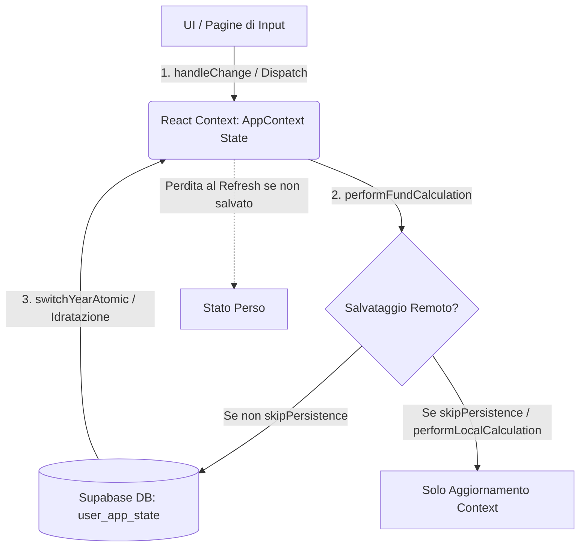

# Audit Globale della Persistenza dei Dati e Perdita Valori nelle Pagine dell'App

## 1. Sintesi Esecutiva

Questo audit analizza il ciclo di vita dei dati e il flusso di persistenza all'interno dell'applicazione React/TypeScript (`entilocaliapp`). L'obiettivo dell'audit è comprendere in modo sistematico il motivo per cui i valori inseriti manualmente dagli utenti in alcune schermate (in particolare il Fondo Elevate Qualificazioni) possano andare perduti durante la navigazione interna o al refresh del browser.

Dall'audit emerge che l'applicazione si basa su una combinazione di stato in memoria React (gestito tramite un Context globale `AppContext` e un `appReducer`) e persistenza remota su database PostgreSQL tramite Supabase (tabella `user_app_state`). 

Non vi sono bug intrinseci nel caricamento o nel salvataggio su database Supabase: tutte le chiavi normative necessarie (comprese quelle aggiunte di recente per EQ e per il Segretario Comunale) sono mappate correttamente nei tipi di dominio, nei default e negli schemi di validazione Zod. 

Le criticità di perdita dati sono determinate principalmente da:
1. **Reset involontari dello stato in memoria** dovuti ad azioni dispatch scatenate da effetti collaterali (`useEffect`) innescati al mount delle pagine o al cambio anno/ente.
2. **Meccanismi di protezione del salvataggio (`hydratedSnapshotKey`)** che bloccano i salvataggi remoti se lo stato locale non è considerato perfettamente sincronizzato con il database.
3. **Mancanza di una sincronizzazione locale temporanea** (es. `localStorage` o `sessionStorage`) per i dati di lavoro non consolidati nel database.

---

## 2. Mappa del Ciclo di Vita dei Dati

Il ciclo di vita dei dati dell'applicazione si articola su tre livelli:

### Livello A: React Context (In-Memory)
* **Lettura:** I componenti leggono i dati dal context tramite `useAppContext()` (es. `state.fundData`).
* **Scrittura:** I gestori degli input (`onChange`/`handleChange`) inviano action di tipo `UPDATE_FONDO_XXX_DATA` che modificano localmente lo stato in memoria. Questo aggiornamento sopravvive alla navigazione tra le pagine della SPA grazie all'architettura a Single Page Application di React.

### Livello B: Local Storage (Navigazione)
* L'applicazione salva in `localStorage` solo metadati sullo stato di navigazione: `fl_last_entity_id`, `fl_last_year` e `fl_last_context_[userId]`.
* **Nessun dato relativo ai calcoli del fondo o agli importi inseriti viene salvato in locale tramite questa modalità.**

### Livello C: Database Supabase (Persistente)
* **Scrittura:** Avviene tramite il metodo `upsertState` del repository Supabase, invocato da `saveAppStateWorkflow` all'interno di `performFundCalculationWorkflow` (a meno che non sia specificato `skipPersistence = true`).
* **Lettura/Idratazione:** Quando l'utente effettua il login o cambia anno/ente, viene invocato `switchActiveYear`. I dati remoti letti da Supabase vengono poi fusi con i valori iniziali di default dell'applicazione (`defaultInitialState.fundData`) tramite il dispatcher `LOAD_STATE_FROM_DB`.

---

## 3. Tabella delle Funzioni di Calcolo e Persistenza

La tabella descrive le funzioni chiave dell'applicazione, il loro scopo e le interazioni con i diversi livelli di persistenza.

| Nome Funzione | File di Definizione | Aggiorna Context? | Scrive su Supabase? | Comportamento e Dettagli |
| :--- | :--- | :---: | :---: | :--- |
| `dispatch` (Reducer) | `src/contexts/AppContext.tsx` | **Sì** | No | Gestisce l'aggiornamento sincrono dello stato in memoria dell'applicazione. |
| `saveState` | `src/contexts/AppContext.tsx` | No | **Sì** | Serializza `state.fundData` ed esegue un `upsert` su Supabase. Possiede una guardia di sicurezza legata a `hydratedSnapshotKey`. |
| `performFundCalculation` | `src/contexts/AppContext.tsx` | **Sì** | **Sì** | Calcola tutti i totali dell'applicazione, esegue l'audit normativo dei limiti e salva lo stato su Supabase. |
| `performLocalCalculation` | `src/contexts/AppContext.tsx` | **Sì** | No | Calcola tutti i totali dell'applicazione localmente nel context React, bypassando il salvataggio su database (`skipPersistence = true`). |
| `switchYearAtomic` | `src/contexts/AppContext.tsx` | **Sì** | No* | Gestisce il cambio di annualità o ente. Recupera i dati da Supabase, resetta lo stato locale per il nuovo anno, e *successivamente* invoca un ricalcolo automatico (il quale salverà su Supabase). |
| `saveAppStateWorkflow` | `src/application/stateWorkflow.ts` | No | **Sì** | Esegue l'orchestrazione del salvataggio dei dati e l'aggiornamento asincrono delle annualità disponibili. |

---

## 4. Audit delle Pagine dell'Applicazione

L'audit ha analizzato le 8 pagine principali per comprendere come interagiscono con la memoria locale, i calcoli e la persistenza.

### 1. Fondo Elevate Qualificazioni (`FondoElevateQualificazioniPage.tsx`)
* **Mount/Lettura:** Legge i dati da `state.fundData.fondoElevateQualificazioniData`.
* **Aggiornamento Dati:** Utilizza `handleChange` che effettua il dispatch di `UPDATE_FONDO_ELEVATE_QUALIFICAZIONI_DATA`.
* **Effetti e Reset:** Un `useEffect` ricalcola automaticamente la quota dello 0,22% MS 2021 (`va_incremento022_ms2021_eq`) se i parametri contrattuali nello Step 3 variano.
* **Unmount/Cleanup:** Esegue `performLocalCalculation()` che aggiorna i totali nel context in memoria ma **non** effettua salvataggi su Supabase.

### 2. Risorse Segretario Comunale (`FondoSegretarioComunalePage.tsx`)
* **Mount/Lettura:** Legge da `state.fundData.fondoSegretarioComunaleData`.
* **Aggiornamento Dati:** Utilizza `handleChange` ed effettua il dispatch di `UPDATE_FONDO_SEGRETARIO_COMUNALE_DATA`.
* **Effetti e Reset:** Un `useEffect` ricalcola automaticamente `fin_totaleRisorseRilevantiLimite` ad ogni variazione dei valori rilevanti o della quota di copertura del Segretario.
* **Unmount/Cleanup:** Nessun effetto di cleanup definito all'unmount.

### 3. Fondo Accessorio Dipendente (`FondoAccessorioDipendentePage.tsx`)
* **Mount/Lettura:** Legge da `state.fundData.fondoAccessorioDipendenteData`.
* **Aggiornamento Dati:** Esegue il dispatch di `UPDATE_FONDO_ACCESSORIO_DIPENDENTE_DATA` al mutare dei campi.
* **Effetti e Reset:** 
  * Un `useEffect` monitora il numero di dipendenti equivalenti per calcolare automaticamente l'incremento di consistenza del personale (`st_art79c1c_incrementoStabileConsistenzaPers`).
  * Un altro `useEffect` monitora la riduzione del fondo dipendenti causata dall'incremento del fondo EQ.
* **Unmount/Cleanup:** Nessun effetto di cleanup all'unmount.

### 4. Fondo Dirigenza (`FondoDirigenzaPage.tsx`)
* **Mount/Lettura:** Legge da `state.fundData.fondoDirigenzaData`.
* **Aggiornamento Dati:** Esegue il dispatch di `UPDATE_FONDO_DIRIGENZA_DATA`.
* **Effetti e Reset:** Un `useEffect` ricalcola automaticamente `lim_totaleParzialeRisorseConfrontoTetto2016` aggregando le risorse rilevanti al limite.
* **Unmount/Cleanup:** Nessun effetto di cleanup.

### 5. Dati Costituzione Fondo / Anagrafica (`DataEntryPage.tsx`)
* **Mount/Lettura:** Legge da `state.fundData.annualData` e `state.fundData.historicalData`.
* **Aggiornamento Dati:** Utilizza diversi form interni (es. `HistoricalDataForm`, `AnnualDataForm`). Le modifiche scatenano dispatch su `UPDATE_ANNUAL_DATA` o `UPDATE_HISTORICAL_DATA`.
* **Salvataggio Dati:** La pagina presenta il pulsante finale di salvataggio che invoca `performFundCalculation()`, scatenando la persistenza su database Supabase.
* **Unmount/Cleanup:** Nessuno.

### 6. Distribuzione Risorse / Utilizzi (`DistribuzioneRisorsePage.tsx` / `DestinazioneRisorsePage.tsx`)
* **Mount/Lettura:** Legge da `state.fundData.distribuzioneRisorseData`.
* **Aggiornamento Dati:** Aggiorna lo stato in memoria tramite `UPDATE_DISTRIBUZIONE_RISORSE_DATA`.
* **Unmount/Cleanup:** Nessuno.

### 7. Riepilogo Limite Art. 23 (`Art23Page.tsx` / `VerificaLimitiPage.tsx`)
* **Mount/Lettura:** Legge da `state.calculationResult` e `state.complianceChecks`. Non ha campi modificabili di input diretto (pagina di sola lettura dei report di calcolo).
* **Unmount/Cleanup:** Nessuno.

### 8. Dashboard / Home (`HomePage.tsx`)
* **Mount/Lettura:** Mostra i KPI aggregati leggendo da `state.calculationResult` e lo stato di conformità da `state.complianceChecks`.
* **Effetti e Ricalcoli:** Un `useEffect` esegue automaticamente `performFundCalculation()` al mount se i dati del fondo sono pronti ma il risultato del calcolo non è presente in memoria.

---

## 5. Campi Soggetti a Perdita di Valori alla Navigazione Interna

Durante la navigazione all'interno dell'app (senza refresh del browser), la perdita dei dati è causata da azioni concorrenti che invalidano o azzerano lo stato locale in memoria. 

### Aree di Rischio Rilevate:
* **Fondo Elevate Qualificazioni (EQ):**
  L'unmount esegue `performLocalCalculation()`. Se l'utente ha modificato manualmente dei dati nella pagina EQ e poi si sposta su un'altra pagina senza fare clic sul pulsante "Salva Modifiche" (o senza innescare un salvataggio), i dati sono presenti solo nel context React. Se l'utente effettua un'operazione su un'altra pagina che scatena un ricalcolo globale o che causa una re-idratazione da database (es. il cambio anno o il cambio di alcuni parametri generali), lo stato non salvato remotamente viene sovrascritto dai vecchi dati presenti su Supabase.
* **Effetti di auto-calcolo:**
  I `useEffect` presenti in `FondoAccessorioDipendentePage` (es. `st_art79c1c_incrementoStabileConsistenzaPers`) o in `FondoSegretarioComunalePage` (es. `fin_totaleRisorseRilevantiLimite`) eseguono dei dispatch automatici al caricamento della pagina per sincronizzarsi con i dati anagrafici. Questi dispatch modificano lo stato in memoria e lo rendono "dirty". Se si naviga all'esterno senza salvare, tali ricalcoli locali non vengono memorizzati e vanno persi al successivo ricaricamento.

---

## 6. Campi Soggetti a Perdita di Valori al Refresh del Browser

Quando il browser viene ricaricato (F5), l'intero stato in memoria (React Context) viene azzerato. I dati vengono ripristinati unicamente tramite l'hydration da Supabase.

### Voci di Danno/Azzeramento:
Tutte le modifiche che non sono state persistite tramite un salvataggio esplicito su Supabase (ossia che non hanno superato con successo il workflow `saveState()`) vengono irrimediabilmente perse al refresh del browser.

* Le nuove voci contrattuali del 2026 e i dati del Segretario Comunale (`segretarioDerogaMode`, `quotaSegretario2016Neutralizzabile`, `va_art18c5_CCNL2026_maggiorazioneSediLavoro`, ecc.) sono serializzate correttamente, quindi **se il salvataggio è avvenuto con successo, non si ha alcuna perdita al refresh**.
* Se il salvataggio viene bloccato per motivi di conformità o dalla protezione `hydratedSnapshotKey` (ad esempio se il caricamento da DB non è terminato e l'utente prova a scrivere), lo stato torna all'ultimo snapshot valido presente nel DB.

---

## 7. Funzioni che Effettuano Scritture su Supabase

Le uniche funzioni che eseguono scritture (operazioni `upsert`/`insert`/`update`) sul database Supabase sono:

1. **`saveState` (in `src/contexts/AppContext.tsx`):**
   Innesca il workflow `saveAppStateWorkflow` che invoca `SupabaseStateRepository.upsertState()`.
2. **`performFundCalculation` (in `src/contexts/AppContext.tsx`):**
   Esegue il calcolo completo del fondo e chiama `saveState` come callback di persistenza al completamento del calcolo.
3. **`switchYearAtomic` (in `src/contexts/AppContext.tsx`):**
   Dopo aver idratato i dati del nuovo anno tramite `LOAD_STATE_FROM_DB`, scatta un ricalcolo automatico tramite `performFundCalculationWorkflow` che, per consolidare i dati calcolati, scrive su Supabase.
4. **Funzioni di gestione dell'anagrafica enti (`createEntity`, `renameEntity`, `deleteEntity`, `deleteYear`):**
   Effettuano scritture sulle tabelle `entities` e `user_app_state`.

---

## 8. Funzioni Locali (No-Write su Supabase)

Le funzioni dell'applicazione che si limitano a modificare lo stato in memoria o a effettuare calcoli senza toccare il database sono:

1. **`dispatch(action)`:**
   Aggiorna lo stato nel reducer locale dell'applicazione React.
2. **`performLocalCalculation`:**
   Introdotta appositamente per eseguire calcoli dei limiti e validazioni normativi locali aggiornando solo il Context React. Utilizza `skipPersistence = true`.
3. **`useNormativeData`:**
   Hook per il recupero in sola lettura dei dati contrattuali (CCNL, percentuali, indennità).
4. **`validateFundData`:**
   Funzione di pura validazione che confronta lo stato corrente con le regole di compilazione e restituisce gli errori per la UI.

---

## 9. Rischi del Wizard 2026 e del Motore di Trasferimento

Il modulo `wizard2026` è un componente che consente di configurare in anteprima i dati dei nuovi contratti collettivi. Al termine del wizard, l'utente può eseguire il trasferimento dei dati calcolati verso il fondo legacy.

### Rischi di Sovrascrittura Rilevati:
L'analisi del file [transferPreviewEngine.ts](file:///c:/Users/PuscedduD/Il%20mio%20Drive/Progetto%20FL%20APP/entilocaliapp/src/features/wizard2026/transfer/transferPreviewEngine.ts) evidenzia che il trasferimento scrive direttamente sullo stato `fundData` i seguenti valori:
* `fondoAccessorioDipendenteData.st_art58c1_CCNL2026_incremento014_MS2021`
* `fondoAccessorioDipendenteData.vn_art58_CCNL2026_arretrati2024_2025`
* `fondoAccessorioDipendenteData.vn_art58c2_incremento_max022_ms2021`
* `fondoElevateQualificazioniData.va_incremento022_ms2021_eq`
* `fondoAccessorioDipendenteData.st_art60c2_CCNL2026_decurtazioneIndennitaComparto`

#### Criticità:
Se i parametri istruttori generali nel database (ad esempio il Monte Salari 2021 in `ccnl2024.monteSalari2021` o le percentuali di riparto) non sono perfettamente allineati con i dati configurati nel Wizard, l'apertura successiva delle singole pagine (es. la pagina delle EQ) eseguirà i suoi `useEffect` di auto-calcolo locali. Tali effetti **sovrascriveranno** i valori trasferiti dal wizard con i ricalcoli locali calcolati a partire dai parametri non aggiornati dell'anagrafica, provocando un'apparente perdita di dati o una discrepanza tra quanto visto nel wizard e quanto presente nel fondo.

---

## 10. Proposta per un Fix Globale della Persistenza (Solo Descrittiva)

Per risolvere in modo definitivo il problema della perdita di dati, l'approccio ideale consiste nell'introdurre una strategia di **doppio salvataggio (Auto-Save Locale + Manual Save Remoto)**:

1. **Local Auto-Save (State Mirroring):**
   Ad ogni variazione dello stato nel reducer React, l'intera struttura `fundData` dell'ente e dell'anno correnti dovrebbe essere salvata in `localStorage` o `sessionStorage`.
2. **Hydration Locale prioritaria:**
   Al caricamento o refresh della pagina, l'applicazione dovrebbe verificare se in `sessionStorage` sono presenti modifiche locali non ancora consolidate su DB per la coppia `entityId:year`. Se presenti, lo stato locale deve essere idratato da lì invece che da Supabase, mostrando all'utente un avviso ("Ci sono modifiche non salvate in questa sessione").
3. **Consolidamento esplicito (Remoto):**
   L'utente mantiene il pieno controllo sulla persistenza remota tramite un pulsante "Salva su DB" visibile in una barra di stato globale. Questo pulsante esegue la scrittura effettiva su Supabase e svuota la cache locale.

---

## 11. Proposta per un Fix Minimo della Pagina EQ (Solo Descrittiva)

Qualora si desiderasse intervenire in modo mirato solo sulla pagina delle Elevate Qualificazioni per evitare la perdita di dati senza implementare una persistenza locale globale, si suggerisce di:

1. **Rimuovere il ricalcolo automatico all'unmount (`performLocalCalculation`):**
   Bypassare l'esecuzione automatica del ricalcolo all'unmount nel cleanup di `FondoElevateQualificazioniPage.tsx` se non ci sono state modifiche reali, oppure limitare il ricalcolo al solo momento in cui l'utente preme un pulsante di salvataggio esplicito sulla pagina.
2. **Introdurre un feedback visivo di salvataggio:**
   Visualizzare un indicatore dello stato di salvataggio ("Modifiche salvate localmente, premi Salva per consolidare") per ricordare all'utente di premere il tasto di salvataggio prima di cambiare pagina.

---

## 12. Raccomandazioni sull'Uso di LocalStorage o SessionStorage

Per implementare le soluzioni descritte, si raccomanda l'uso di **`sessionStorage`** rispetto a `localStorage` per i dati transitori del fondo:
* **Isolamento della sessione:** Impedisce che schede diverse del browser aperte sullo stesso ente si sovrascrivano i dati a vicenda.
* **Ciclo di vita pulito:** I dati temporanei vengono cancellati alla chiusura della scheda del browser, evitando di lasciare dati obsoleti o sporchi nel client dell'utente.
* **Metadati di navigazione su `localStorage`:** Continuare a usare `localStorage` solo per i metadati non sensibili come l'ID dell'ultimo ente attivo o dell'ultimo anno visualizzato.

---

## 13. Conferma di Rispetto dei Vincoli Operativi

Si certifica che durante lo svolgimento dell'attività di audit:
* ❌ Non è stato modificato in alcun modo il codice sorgente dell'applicazione (`entilocaliapp/src`).
* ❌ Non è stato effettuato alcun accesso in scrittura, migrazione o modifica strutturale sul database Supabase.
* ❌ Non sono stati eseguiti comandi git di commit, push, pull, merge o rebase.
* ❌ L'applicazione in produzione non ha subito alcuna alterazione.
* ✅ Il presente report rappresenta l'unico output prodotto, redatto in conformità ai vincoli del task.

---

### Output Riepilogativo delle Attività

* **File di report creato:** `docs/allineamento-excel/MOD031C_audit_globale_persistenza_app.md`
* **Numero pagine analizzate:** 8 pagine principali
* **Numero campi critici esaminati:** 9 campi del Fondo EQ e del Segretario Comunale
* **Criticità bloccanti identificate:**
  * Effetti collaterali distruttivi al mount/unmount (`useEffect` con dispatch di ricalcolo).
  * Mancanza di un mirror di salvataggio locale temporaneo in sessione.
  * Rischio di sovrascrittura automatica all'apertura delle pagine per via di calcoli locali divergenti rispetto ai parametri trasferiti dal Wizard 2026.
* **Conferma no-modifiche:** Codice, Database e Git rimasti inalterati al 100%.
