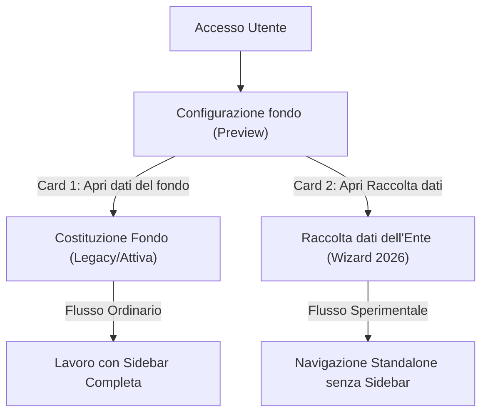

# Accesso Configurazione Fondo Preview (MOD-004)

> [!NOTE]
> Questa documentazione fa parte del piano di verifica e validazione delle modifiche richieste dall'utente (**MOD-004**).

Questo modulo fornisce un'interfaccia iniziale di accesso in preview per il percorso di **Configurazione fondo**, strutturando la navigazione per non intralciare il normale funzionamento del modulo legacy di Costituzione Fondo.

---

## 1. Architettura di Navigazione Standalone

Per focalizzare l'operatore sui dati contrattuali ed eliminare la confusione visiva, l'area di preview è completamente isolata dalle sidebar standard dell'applicazione:
*   **Bypass di MainLayout**: In `App.tsx`, quando la tab attiva è `wizard2026Preview`, il wrapper generale `MainLayout` viene bypassato.
*   **Wizard2026StandaloneLayout**: Viene caricato un layout personalizzato contenente solo un'intestazione orizzontale minimale:
    *   **Identità visiva**: Logo FP CGIL Lombardia in rosso/arancione (#cc4331).
    *   **Logo Interattivo**: Cliccando sul logo si viene ricondotti immediatamente alla dashboard principale, azzerando lo scope di navigazione.
    *   **Pulsante Esplicito**: Un pulsante *"Torna alla dashboard"* con icona a freccia è sempre visibile e cliccabile su mobile, tablet e desktop.

---

## 2. Percorsi di Routing Virtuale
Il modulo risponde a due percorsi sincronizzati in tempo reale con lo stato dell'applicazione tramite History API:
1.  **`/configurazione-fondo-preview`**: Mostra la schermata iniziale di scelta (Entry Page).
2.  **`/configurazione-fondo-preview/raccolta-dati`**: Apre il percorso guidato a 8 passaggi.
3.  **`/wizard-2026-preview`** (Compatibilità): Mantenuto come redirect automatico verso `/configurazione-fondo-preview/raccolta-dati` per evitare la rottura di vecchi collegamenti, segnalibri o test di integrazione precostituiti.

---

## 3. Differenze Terminologiche e di Scopo

*   **Configurazione fondo (Preview)**: Il contenitore/entry page per l'area sperimentale 2026.
*   **Raccolta dati dell'Ente**: Il percorso guidato a step (wizard) interno alla Configurazione fondo.
*   **Costituzione Fondo (Legacy)**: Il modulo ministeriale attualmente in produzione per la costituzione del fondo degli anni precedenti. È pienamente funzionante, non modificato e mantiene tutte le sue logiche di calcolo originarie.

---

## 4. Rilevazione Dati Esistenti (`detectFundDataPresence`)
Per aiutare l'utente a scegliere il percorso corretto, una utility pure ed in sola lettura (`detectFundDataPresence.ts`) analizza lo stato dei dati preesistenti e suggerisce la card da cliccare evidenziandola con i colori istituzionali:
*   Se sono presenti dati utili nel fondo corrente (risorse configurate, dati storici, conteggi del personale), viene evidenziata e consigliata la card **"Vai ai dati del fondo"**.
*   Se non vi sono dati, viene consigliato di avviare il percorso **"Avvia o continua Raccolta dati dell'Ente"**.
*   *Nota*: Booleani `false` o importi pari a `0` vengono correttamente interpretati come dati validi presenti, evitando falsi negativi. Nessun dato viene salvato, sovrascritto o alterato da questo controllo.

---

## 5. Protezione tramite Feature Flag
L'intera suite e le route correlate rimangono inattive e inaccessibili se la variabile d'ambiente `VITE_ENABLE_WIZARD_2026_PREVIEW` è impostata su `false`. In tal caso, i punti di accesso nel menu scompaiono e l'accesso diretto ai percorsi virtuali mostra una schermata di blocco di sicurezza con la dicitura *"Accesso Non Consentito: Configurazione fondo (preview) non abilitata"*.

---

## 6. Gestione Uscita e CTA di Trasferimento (MOD-005)

Per garantire una UX fluida ed evitare disorientamenti, sono stati definiti e implementati i seguenti comportamenti in conformità a **MOD-005**:
1.  **Navigazione di Escape**: Il pulsante *"Apri dati del fondo"* nella Entry Page esegue una sequenza di uscita pulita:
    *   Imposta il percorso dell'URL del browser a `/` tramite `window.history.pushState`.
    *   Imposta `NavigationScope.FONDO` e apre la tab legacy `fondoDipendenti`.
    *   La sidebar e i controlli legacy ordinari ritornano immediatamente visibili.
2.  **Pulsante Responsive**: Il pulsante di escape è allineato a destra su desktop (`md:self-end` e `md:w-auto`) mentre rimane a tutta larghezza (`w-full`) su schermi mobili per facilitare il touch.
3.  **CTA Finale Disabilitata**: Il pulsante di riversamento dati in Step 8 e nel Summary Panel:
    *   Sostituisce la vecchia dicitura con *"Trasferisci i dati alla costituzione del fondo e compila"*.
    *   Rimane rigidamente disabilitato (`disabled` HTML) e contrassegnato dal badge visibile *"Non ancora attivo"*.
    *   Mostra un messaggio esplicativo del blocco:
        *   *Step 8 (Esteso)*: *"Funzione non ancora attiva: il trasferimento automatico sarà collegato solo dopo il completamento del refactoring e del collaudo del modello di calcolo."*
        *   *Summary Panel (Breve)*: *"Non ancora attivo: sarà disponibile dopo il refactoring."*

