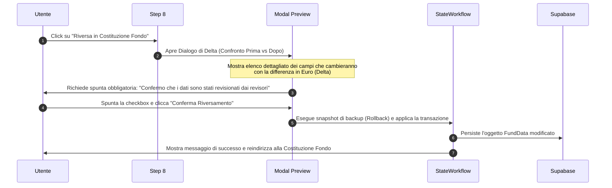

# Audit Tecnico Reale dei Campi della Costituzione Fondo e Classificazione Art. 23

Questo documento costituisce l'audit tecnico reale dei campi attualmente utilizzati per il calcolo del fondo accessorio e la conformità al limite dell'Art. 23, comma 2, del D.Lgs. 75/2017, in raccordo con il nuovo wizard **"Raccolta dati dell’Ente / Configurazione fondo"** (collocato in `src/features/wizard2026/`).

---

## 1. Elenco dei File Analizzati

Nel corso dell'audit sono stati analizzati in dettaglio i seguenti file del codice sorgente dell'applicazione:

1. **[types.ts](file:///c:/Users/PuscedduD/Il%20mio%20Drive/Progetto%20FL%20APP/entilocaliapp/types.ts)**: File bridge di radice per l'esportazione dei tipi di dominio.
2. **[src/domain/types.ts](file:///c:/Users/PuscedduD/Il%20mio%20Drive/Progetto%20FL%20APP/entilocaliapp/src/domain/types.ts)**: Definizioni dei modelli TypeScript core (`FondoAccessorioDipendenteData`, `FondoElevateQualificazioniData`, `FondoDirigenzaData`, `AnnualData` e `FundData`).
3. **[src/data/strutturaFondo.json](file:///c:/Users/PuscedduD/Il%20mio%20Drive/Progetto%20FL%20APP/entilocaliapp/src/data/strutturaFondo.json)**: Mappa strutturale del fondo accessorio con l'assegnazione degli operatori contabili (`+` / `-`) e la rilevanza iniziale per l'Art. 23.
4. **[src/pages/FondoAccessorioDipendentePage.tsx](file:///c:/Users/PuscedduD/Il%20mio%20Drive/Progetto%20FL%20APP/entilocaliapp/src/pages/FondoAccessorioDipendentePage.tsx)**: Vista principale per la Costituzione del Fondo dipendenti, contenente complessi hook di sincronizzazione dinamica (`useEffect`) ed eventi di validazione.
5. **[src/logic/fundEngine.ts](file:///c:/Users/PuscedduD/Il%20mio%20Drive/Progetto%20FL%20APP/entilocaliapp/src/logic/fundEngine.ts)** (e `src/logic/calculation/fundEngine.ts`): Motore di calcolo principale per la aggregazione delle risorse e la verifica della conformità.
6. **[src/logic/fundCalculations.ts](file:///c:/Users/PuscedduD/Il%20mio%20Drive/Progetto%20FL%20APP/entilocaliapp/src/logic/fundCalculations.ts)**: Sotto-funzioni per il calcolo dei totali di sezione (FAD, EQ) e per l'adeguamento pro-capite del tetto.
7. **[src/features/wizard2026/types.ts](file:///c:/Users/PuscedduD/Il%20mio%20Drive/Progetto%20FL%20APP/entilocaliapp/src/features/wizard2026/types.ts)**: Definizione dello stato bozza del nuovo wizard (`Wizard2026DraftState`).
8. **[src/features/wizard2026/mappingPreview.ts](file:///c:/Users/PuscedduD/Il%20mio%20Drive/Progetto%20FL%20APP/entilocaliapp/src/features/wizard2026/mappingPreview.ts)**: Logica preliminare per la visualizzazione delta dei campi riversati dal wizard.
9. **[src/features/wizard2026/steps/Step8RiepilogoPreview.tsx](file:///c:/Users/PuscedduD/Il%20mio%20Drive/Progetto%20FL%20APP/entilocaliapp/src/features/wizard2026/steps/Step8RiepilogoPreview.tsx)**: UI di sintesi per la visualizzazione delle bozze e della conformità prima dell'invio.
10. **[docs/refactoring/matrice-campi-costituzione-fondo-art23.md](file:///c:/Users/PuscedduD/Il%20mio%20Drive/Progetto%20FL%20APP/entilocaliapp/docs/refactoring/matrice-campi-costituzione-fondo-art23.md)**: Documentazione preliminare della matrice dei campi.

---

## 2. Disallineamento Tecnico Rilevato (Quirk del Sistema)

Durante l'analisi del file di configurazione `src/data/strutturaFondo.json` e del motore di calcolo `src/logic/fundEngine.ts` è emerso un importante disallineamento concettuale rispetto alla documentazione ordinaria:

> [!WARNING]
> **Mismatch di Rilevanza Art. 23**
> Nel codice, le singole voci positive della parte stabile del FAD (ad es. `st_art79c1_art67c1_unicoImporto2017`, `st_art79c1_art4c2_art67c2c_integrazioneRIA`, ecc.) sono configurate con `isRelevantToArt23Limit: false`. 
> Solo i **sottrattori stabili** (tagli come `st_taglioFondoDL78_2010` o `st_art60c2_CCNL2026_decurtazioneIndennitaComparto`) e le **voci variabili soggette** (`vs_soggette`) sono impostati come `true`.
> 
> **Spiegazione Matematica/Contabile**:
> Il motore di calcolo esegue il controllo dell'Art. 23 operando in modo **differenziale/incrementale**:
> 1. Costruisce il limite complessivo di riferimento partendo da una base storica pre-calcolata del 2016 (`fondoBase2016`) che include già al suo interno le risorse stabili storiche di quell'anno (corrispondenti all'odierno `unicoImporto2017`).
> 2. Di conseguenza, nel calcolo corrente (`ammontareSoggettoLimite2016`), le risorse stabili ordinarie non vengono risommate (altrimenti verrebbero duplicate rispetto alla base 2016). Si sommano solo le variazioni nette (ad es. le riduzioni stabili o le risorse EQ stabili) e le risorse variabili correnti.
> 
> Ai fini del nostro audit, classifichiamo queste voci positive come `INSIDE_LIMIT` in base al loro comportamento normativo reale (saturano il tetto storico dell'ente), pur registrando la modalità tecnica con cui il motore legacy evita la duplicazione contabile.

---

## 3. Tabella Unificata dei Campi Legacy e Classificazione Art. 23

La tabella seguente censisce analiticamente tutti i campi dei sotto-fondi e delle configurazioni annuali, verificando la loro presenza fisica nel codice, il comportamento rispetto all'Art. 23 e la modalità di trasferimento proposta.

| Campo tecnico | Etichetta utente | Area | Fonte | Destinazione | Tipo dato | Art. 23 | Trasferimento | Note |
|---|---|---|---|---|---|---|---|---|
| **FAD - RISORSE STABILI** | | | | | | | | |
| `st_art79c1_art67c1_unicoImporto2017` | Unico importo consolidato 2017 | Fondo Dipendenti | Legacy / DB | `FADData.st_art79c1_art67c1...` | Valuta | `INSIDE_LIMIT` | Non trasferire | Base storica consolidata |
| `st_art79c1_art67c1_alteProfessionalitaNonUtil` | Alte professionalità non utilizzate al 2017 | Fondo Dipendenti | Legacy / DB | `FADData.st_art79c1_art67c1...` | Valuta | `INSIDE_LIMIT` | Non trasferire | Storica ex Art. 67 c. 1 |
| `st_art79c1_art67c2a_incr8320` | Incremento €83,20 pro-capite (pers. 2015) | Fondo Dipendenti | Legacy / DB | `FADData.st_art79c1_art67c2a...` | Valuta | `OUTSIDE_LIMIT` | Non trasferire | Esclusione contrattuale stabile |
| `st_art79c1_art67c2b_incrStipendialiDiff` | Incrementi stipendiali differenziali 2018 | Fondo Dipendenti | Legacy / DB | `FADData.st_art79c1_art67c2b...` | Valuta | `OUTSIDE_LIMIT` | Non trasferire | Esclusione contrattuale stabile |
| `st_art79c1_art4c2_art67c2c_integrazioneRIA` | Integrazione RIA personale cessato anno prec. | Fondo Dipendenti | Legacy / DB | `FADData.st_art79c1_art4c2...` | Valuta | `INSIDE_LIMIT` | Non trasferire | Storico RIA cessati |
| `st_art79c1_art67c2d_risorseRiassorbite165` | Risorse riassorbite ex D.Lgs. 165/2001 | Fondo Dipendenti | Legacy / DB | `FADData.st_art79c1_art67c2d...` | Valuta | `INSIDE_LIMIT` | Non trasferire | Riassorbimento stabili |
| `st_art79c1_art15c1l_art67c2e_personaleTrasferito` | Risorse personale trasferito (decentramento) | Fondo Dipendenti | Legacy / DB | `FADData.st_art79c1_art15c1l...` | Valuta | `INSIDE_LIMIT` | Non trasferire | Trasferimento di limite |
| `st_art79c1_art15c1i_art67c2f_regioniRiduzioneDirig` | Regioni: riduzione stabile posti dirigenziali | Fondo Dipendenti | Legacy / DB | `FADData.st_art79c1_art15c1i...` | Valuta | `INSIDE_LIMIT` | Non trasferire | Risorsa specifica Regioni |
| `st_art79c1_art14c3_art67c2g_riduzioneStraordinario` | Riduzione stabile straordinario per Fondo | Fondo Dipendenti | Wizard Step 6 | `FADData.st_art79c1_art14c3...` | Valuta | `INSIDE_LIMIT` | Diretto | Riversata permanentemente da Step 6 |
| `st_art79c1b_euro8450` | Incremento €84,50 pro-capite (pers. 2018) | Fondo Dipendenti | Legacy / DB | `FADData.st_art79c1b_euro8450` | Valuta | `OUTSIDE_LIMIT` | Non trasferire | Esclusione contrattuale stabile |
| `st_art79c1c_incrementoStabileConsistenzaPers` | Incremento stabile consistenza personale | Fondo Dipendenti | Legacy / Page | `FADData.st_art79c1c_incremento...` | Valuta | `OUTSIDE_LIMIT` | Non trasferire | Gestito da `useEffect` in pagina legacy |
| `st_art79c1d_differenzialiStipendiali2022` | Differenziali stipendiali CCNL 2022 | Fondo Dipendenti | Legacy / DB | `FADData.st_art79c1d_differenziali...` | Valuta | `OUTSIDE_LIMIT` | Non trasferire | Esclusione CCNL 2022 |
| `st_art79c1bis_diffStipendialiB3D3` | Differenziali stipendiali posizioni B3/D3 | Fondo Dipendenti | Legacy / DB | `FADData.st_art79c1bis_diff...` | Valuta | `OUTSIDE_LIMIT` | Non trasferire | Conservazione differenziali |
| `st_taglioFondoDL78_2010` | Taglio stabile fondo D.L. 78/2010 | Fondo Dipendenti | Legacy / DB | `FADData.st_taglioFondoDL78_2010` | Valuta | `INSIDE_LIMIT` | Non trasferire | Sottrattore permanente |
| `st_riduzioniPersonaleATA_PO_Esternalizzazioni` | Riduzioni per ATA, esternalizzazioni, ecc. | Fondo Dipendenti | Legacy / DB | `FADData.st_riduzioniPersonaleATA...` | Valuta | `INSIDE_LIMIT` | Non trasferire | Sottrattore permanente |
| `st_art67c1_decurtazionePO_AP_EntiDirigenza` | Decurtazione PO/AP enti con dirigenza | Fondo Dipendenti | Legacy / DB | `FADData.st_art67c1_decurtazionePO...` | Valuta | `INSIDE_LIMIT` | Non trasferire | Sottrattore permanente |
| `st_incrementoDecretoPA` | Incremento D.L. 75/2023 (Decreto PA bis) | Fondo Dipendenti | Legacy / DB | `FADData.st_incrementoDecretoPA` | Valuta | `INSIDE_LIMIT` | Deprecato | Sostituito da `st_incrementoDL25_2025` |
| `st_art58c1_CCNL2026_incremento014_MS2021` | Incremento stabile 0,14% Monte Salari 2021 | Fondo Dipendenti | Wizard Step 4 | `FADData.st_art58c1_CCNL2026...` | Valuta | `OUTSIDE_LIMIT` | Diretto | Riversato stabilmente da Step 4 |
| `st_incrementoDL25_2025` | Incremento D.L. 25/2025 (soglia 48%) | Fondo Dipendenti | Wizard Step 3 | `FADData.st_incrementoDL25_2025` | Valuta | `INSIDE_LIMIT` | Solo con conferma | Richiede deliberazione di contrattazione |
| `st_riduzionePerIncrementoEQ` | Riduzione stabile per incremento risorse EQ | Fondo Dipendenti | Legacy / Page | `FADData.st_riduzionePerIncrementoEQ`| Valuta | `FIGURATIVE_ONLY`| Non trasferire | Sincronizzato con EQ in pagina legacy |
| `st_art60c2_CCNL2026_decurtazioneIndennitaComparto`| Riduzione permanente per conglobamento comparto| Fondo Dipendenti | Wizard Step 5 | `FADData.st_art60c2_CCNL2026...` | Valuta | `FIGURATIVE_ONLY`| Diretto | Riversato stabilmente da Step 5 |
| `st_riduzioneFondoStraordinario` | Riduzione stabile per finanziare straordinario | Fondo Dipendenti | Legacy / Page | `FADData.st_riduzioneFondoStraordinario`| Valuta | `INSIDE_LIMIT` | Non trasferire | Sincronizzato con straordinario in pagina |
| **FAD - RISORSE VARIABILI SOGGETTE** | | | | | | | | |
| `vs_art4c3_art15c1k_art67c3c_recuperoEvasione` | Recupero evasione tributaria (ICI/IMU) | Fondo Dipendenti | Legacy / DB | `FADData.vs_art4c3_art15c1k...` | Valuta | `INSIDE_LIMIT` | Non trasferire | Inserimento manuale dell'anno |
| `vs_art4c2_art67c3d_integrazioneRIAMensile` | Integrazione RIA cessati in corso d'anno | Fondo Dipendenti | Legacy / DB | `FADData.vs_art4c2_art67c3d...` | Valuta | `INSIDE_LIMIT` | Non trasferire | Quota mensile pro-rata |
| `vs_art67c3g_personaleCaseGioco` | Risorse personale case da gioco | Fondo Dipendenti | Legacy / DB | `FADData.vs_art67c3g_personale...` | Valuta | `INSIDE_LIMIT` | Non trasferire | Sezioni specifiche |
| `vs_art79c2b_max1_2MonteSalari1997` | Quota storica max 1,2% Monte Salari 1997 | Fondo Dipendenti | Legacy / DB | `FADData.vs_art79c2b_max1_2...` | Valuta | `INSIDE_LIMIT` | Non trasferire | Risorsa storica |
| `vs_art67c3k_integrazioneArt62c2e_personaleTrasferito`| Quota variabile personale trasferito | Fondo Dipendenti | Legacy / DB | `FADData.vs_art67c3k_integrazione...` | Valuta | `INSIDE_LIMIT` | Non trasferire | Soggetta a limite |
| `vs_art79c2c_risorseScelteOrganizzative` | Stanziamento per scelte organizzative / TD | Fondo Dipendenti | Legacy / DB | `FADData.vs_art79c2c_risorse...` | Valuta | `INSIDE_LIMIT` | Non trasferire | Variabile generica |
| **FAD - RISORSE VARIABILI ESCLUSE** | | | | | | | | |
| `vn_art15c1d_art67c3a_sponsorConvenzioni` | Sponsorizzazioni, convenzioni, extra | Fondo Dipendenti | Legacy / DB | `FADData.vn_art15c1d_art67c3a...` | Valuta | `OUTSIDE_LIMIT` | Non trasferire | Finanziate da terzi |
| `vn_art54_art67c3f_rimborsoSpeseNotifica` | Quota rimborso spese notifica (messi) | Fondo Dipendenti | Legacy / DB | `FADData.vn_art54_art67c3f...` | Valuta | `OUTSIDE_LIMIT` | Non trasferire | Deroga ex lege |
| `vn_art15c1k_art16_dl98_art67c3b_pianiRazionalizzazione`| Piani di razionalizzazione Art. 16 DL 98 | Fondo Dipendenti | Legacy / DB | `FADData.vn_art15c1k_art16_dl98...`| Valuta | `OUTSIDE_LIMIT` | Non trasferire | Deroga ex lege |
| `vn_art15c1k_art67c3c_incentiviTecniciCondoni` | Incentivi funzioni tecniche e condoni | Fondo Dipendenti | Legacy / DB | `FADData.vn_art15c1k_art67c3c...` | Valuta | `OUTSIDE_LIMIT` | Non trasferire | Codice Contratti Pubblici |
| `vn_art18h_art67c3c_incentiviSpeseGiudizioCensimenti`| Incentivi avvocatura, ISTAT, censimenti | Fondo Dipendenti | Legacy / DB | `FADData.vn_art18h_art67c3c...` | Valuta | `OUTSIDE_LIMIT` | Non trasferire | Deroga ex lege |
| `vn_art15c1m_art67c3e_risparmiStraordinario` | Risparmi da straordinario anno precedente | Fondo Dipendenti | Wizard Step 6 | `FADData.vn_art15c1m_art67c3e...` | Valuta | `OUTSIDE_LIMIT` | Diretto | Riversati come variabile una tantum |
| `vn_art67c3j_regioniCittaMetro_art23c4_incrPercentuale`| Incremento % Regioni e Città Metropolitane | Fondo Dipendenti | Legacy / DB | `FADData.vn_art67c3j_regioni...` | Valuta | `OUTSIDE_LIMIT` | Non trasferire | Deroga specifica comma 4 |
| `vn_art80c1_sommeNonUtilizzateStabiliPrec` | Avanzi stabili trascinati da anno precedente | Fondo Dipendenti | Legacy / DB | `FADData.vn_art80c1_sommeNonUtil...` | Valuta | `OUTSIDE_LIMIT` | Non trasferire | Avanzo già transitato nel tetto |
| `vn_l145_art1c1091_incentiviRiscossioneIMUTARI`| Incentivi riscossione IMU/TARI | Fondo Dipendenti | Legacy / DB | `FADData.vn_l145_art1c1091...` | Valuta | `OUTSIDE_LIMIT` | Non trasferire | Esclusione specifica |
| `vn_l178_art1c870_risparmiBuoniPasto2020` | Risparmi buoni pasto 2020 | Fondo Dipendenti | Legacy / DB | `FADData.vn_l178_art1c870...` | Valuta | `OUTSIDE_LIMIT` | Non trasferire | Risorsa temporanea storica |
| `vn_dl135_art11c1b_risorseAccessorieAssunzioniDeroga`| Risorse accessorie assunzioni in deroga | Fondo Dipendenti | Legacy / DB | `FADData.vn_dl135_art11c1b...` | Valuta | `OUTSIDE_LIMIT` | Non trasferire | Esclusione specifica |
| `vn_art79c3_022MonteSalari2018_da2022Proporzionale`| 0,22% MS 2018 proporzionale stabile | Fondo Dipendenti | Legacy / DB | `FADData.vn_art79c3_022Monte...` | Valuta | `OUTSIDE_LIMIT` | Deprecato | Superato da CCNL 2026 |
| `vn_art79c1b_euro8450_unaTantum2021_2022` | Una tantum €84,50 (anni 2021-2022) | Fondo Dipendenti | Legacy / DB | `FADData.vn_art79c1b_euro8450...` | Valuta | `OUTSIDE_LIMIT` | Deprecato | Scaduto, da eliminare post-collaudo |
| `vn_art79c3_022MonteSalari2018_da2022UnaTantum2022`| Una tantum 0,22% (anno 2022) | Fondo Dipendenti | Legacy / DB | `FADData.vn_art79c3_022Monte...` | Valuta | `OUTSIDE_LIMIT` | Deprecato | Scaduto, da eliminare post-collaudo |
| `vn_art58c2_incremento_max022_ms2021` | Incremento 0,22% MS 2021 destinato a Fondo | Fondo Dipendenti | Wizard Step 4 | `FADData.vn_art58c2_incremento...` | Valuta | `OUTSIDE_LIMIT` | Diretto | Riversato da Step 4 |
| `vn_art58_CCNL2026_arretrati2024_2025` | Arretrati 2024-2025 (una tantum 0,14%) | Fondo Dipendenti | Wizard Step 4 | `FADData.vn_art58_CCNL2026...` | Valuta | `OUTSIDE_LIMIT` | Diretto | Riversato da Step 4 come una tantum |
| `vn_dl13_art8c3_incrementoPNRR_max5stabile2016` | Incremento PNRR (max 5% stabile 2016) | Fondo Dipendenti | Wizard Step 7 | `FADData.vn_dl13_art8c3_incremento...` | Valuta | `OUTSIDE_LIMIT` | Solo con conferma | Deliberato in base a progetti reali |
| **RISORSE ELEVATE QUALIFICAZIONI (EQ)** | | | | | | | | |
| `ris_fondoPO2017` | Fondo risorse PO/EQ 2017 | EQ | Legacy / DB | `EQData.ris_fondoPO2017` | Valuta | `INSIDE_LIMIT` | Non trasferire | Dotazione consolidata storica |
| `ris_incrementoConRiduzioneFondoDipendenti` | Incremento EQ prelevato da Fondo dipendenti | EQ | Legacy / Page | `EQData.ris_incrementoCon...` | Valuta | `INSIDE_LIMIT` | Non trasferire | Invariata sul totale spesa |
| `ris_incrementoLimiteArt23c2_DL34` | Incremento EQ in deroga D.L. 34/2019 | EQ | Legacy / DB | `EQData.ris_incrementoLimite...` | Valuta | `INSIDE_LIMIT` | Non trasferire | Adeguamento spesa accessoria |
| `ris_incremento022MonteSalari2018` | Incremento 0,22% MS 2018 (storico EQ) | EQ | Legacy / DB | `EQData.ris_incremento022Monte...` | Valuta | `OUTSIDE_LIMIT` | Deprecato | Superato da CCNL 2026 |
| `va_incremento022_ms2021_eq` | Incremento 0,22% MS 2021 destinato a EQ | EQ | Wizard Step 4 | `EQData.va_incremento022_ms2021_eq` | Valuta | `OUTSIDE_LIMIT` | Diretto | Quota EQ da riparto Step 4 |
| `st_art16c2_retribuzionePosizione` | Retribuzione di posizione EQ | EQ | Legacy / DB | `EQData.st_art16c2_retribuzione...` | Valuta | `FIGURATIVE_ONLY`| Non trasferire | Voce di utilizzo, non di costituzione |
| `va_art16c3_retribuzioneRisultato` | Retribuzione di risultato EQ | EQ | Legacy / DB | `EQData.va_art16c3_retribuzione...` | Valuta | `FIGURATIVE_ONLY`| Non trasferire | Voce di utilizzo (minimo 15%) |
| `va_dl25_2025_armonizzazione` | Quota incremento D.L. 25/2025 per EQ | EQ | Wizard Step 3 | `EQData.va_dl25_2025_armonizzazione`| Valuta | `INSIDE_LIMIT` | Solo con conferma | Ripartizione contrattata della quota 48% |
| **FONDO DIRIGENZA** | | | | | | | | |
| `st_art57c2a_CCNL2020_unicoImporto2020` | Unico importo consolidato 2020 | Dirigenti | Legacy / DB | `DirigenzaData.st_art57c2a...` | Valuta | `INSIDE_LIMIT` | Non trasferire | Base storica dirigenti |
| `st_art57c2a_CCNL2020_riaPersonaleCessato2020` | RIA personale cessato 2020 dirigenti | Dirigenti | Legacy / DB | `DirigenzaData.st_art57c2a...` | Valuta | `INSIDE_LIMIT` | Non trasferire | Storica |
| `st_art56c1_CCNL2020_incremento1_53MonteSalari2015`| Incremento 1,53% MS 2015 dirigenti | Dirigenti | Legacy / DB | `DirigenzaData.st_art56c1...` | Valuta | `OUTSIDE_LIMIT` | Non trasferire | Escluso da tetto |
| `st_art57c2c_CCNL2020_riaCessatidallAnnoSuccessivo`| RIA cessati anni successivi dirigenti | Dirigenti | Legacy / DB | `DirigenzaData.st_art57c2c...` | Valuta | `INSIDE_LIMIT` | Non trasferire | Dinamica |
| `st_art39c1_CCNL2024_incremento2_01MonteSalari2018`| Incremento 2,01% MS 2018 dirigenti | Dirigenti | Legacy / DB | `DirigenzaData.st_art39c1...` | Valuta | `OUTSIDE_LIMIT` | Deprecato | Superato da contratti successivi |
| `st_art24c1_CCNL2022_2024_incremento3_05MonteSalari2021`| Incremento 3,05% MS 2021 dirigenti | Dirigenti | Legacy / DB | `DirigenzaData.st_art24c1...` | Valuta | `OUTSIDE_LIMIT` | Non trasferire | Contratto 2019-21 |
| `va_art24c3_CCNL2022_2024_incremento0_22MonteSalari2021`| Incremento 0,22% MS 2021 dirigenti | Dirigenti | Legacy / DB | `DirigenzaData.va_art24c3...` | Valuta | `OUTSIDE_LIMIT` | Non trasferire | Contratto 2019-21 |
| `va_art57c2b_CCNL2020_risorseLeggeSponsor` | Risorse ex lege, sponsor, convenzioni dirigenti | Dirigenti | Legacy / DB | `DirigenzaData.va_art57c2b...` | Valuta | `OUTSIDE_LIMIT` | Non trasferire | Entrate terzi escluse |
| `va_art33c2_DL34_2019_incrementoDeroga` | Incremento spesa dirigenti ex D.L. 34/2019 | Dirigenti | Legacy / DB | `DirigenzaData.va_art33c2...` | Valuta | `INSIDE_LIMIT` | Non trasferire | Adeguamento spesa |
| `va_dl13_2023_art8c3_incrementoPNRR` | Incremento PNRR dirigenti (max 5% 2016) | Dirigenti | Wizard Step 7 | `DirigenzaData.va_dl13_2023...` | Valuta | `OUTSIDE_LIMIT` | Solo con conferma | Riversata da Step 7 su conferma |
| **CONTROLLI E VALORI ISTRUTTORI** | | | | | | | | |
| `fondoLavoroStraordinario` | Fondo straordinario ordinario corrente | Controlli / Straordinario | Wizard Step 6 | `AnnualData.fondoLavoroStraordinario` | Valuta | `INSIDE_LIMIT` | Diretto | Popola lo straordinario ordinario |
| `cl_art23c2_decurtazioneIncrementoAnnualeTetto2016`| Decurtazione per sforamento tetto 2016 | Controlli | Legacy / Engine| `FADData.cl_art23c2_decurtazione...`| Valuta | `INSIDE_LIMIT` | Non trasferire | Calcolato dinamicamente dall'Engine |
| `cl_ammontareSoggettoLimite2016` | Spesa accessoria totale soggetta a limite 2016 | Controlli | Legacy / Engine| `FADData.cl_ammontareSoggetto...` | Valuta | `CONTROL_ONLY` | Non trasferire | Calcolato dinamicamente dall'Engine |
| `art23.result.limiteArt23Attualizzato` | Limite Art. 23 attualizzato calcolato | Controlli | Wizard Step 2 | solo controllo | Valuta | `CONTROL_ONLY` | Non trasferire | Tetto massimo attualizzato |
| `dl25.result.limiteMassimoDL25` | Limite massimo teorico D.L. 25/2025 | Controlli | Wizard Step 3 | solo controllo | Valuta | `CONTROL_ONLY` | Non trasferire | Tetto massimo teorico 48% |
| `ccnl2026.result.limiteMassimo022` | Limite massimo 0,22% Monte Salari 2021 | Controlli | Wizard Step 4 | solo controllo | Valuta | `CONTROL_ONLY` | Non trasferire | Tetto massimo contrattuale 0,22% |
| `pnrr.result.limiteMassimoPnrrFondoDipendenti` | Limite massimo PNRR Dipendenti (5% 2016) | Controlli | Wizard Step 7 | solo controllo | Valuta | `CONTROL_ONLY` | Non trasferire | Tetto massimo PNRR |
| `pnrr.result.limiteMassimoPnrrFondoDirigenza` | Limite massimo PNRR Dirigenza (5% 2016) | Controlli | Wizard Step 7 | solo controllo | Valuta | `CONTROL_ONLY` | Non trasferire | Tetto massimo PNRR |

---

## 4. Analisi di Raccordo e Mappatura (Wizard → Costituzione Fondo)

Per implementare la successiva Fase 3 (motore di riversamento), distinguiamo le variabili del wizard in quattro categorie operative ben definite.

### 4.1 Campi Trasferibili Direttamente (Fondo accessorio effettivo)
Questi campi contengono valori derivati da obblighi contrattuali (ad es. 0,14% stabile o arretrati) o da precise decurtazioni stabili calcolate nel wizard (Art. 60 conglobamento). Possono essere riversati direttamente nei campi corrispondenti di `FundData`:

1. **Step 4 — Incremento stabile 0,14%**: 
   - `ccnl2026.result.incrementoStabile014` → `fondoAccessorioDipendenteData.st_art58c1_CCNL2026_incremento014_MS2021`
2. **Step 4 — Arretrati 0,14%**: 
   - `ccnl2026.result.arretrati014` → `fondoAccessorioDipendenteData.vn_art58_CCNL2026_arretrati2024_2025`
3. **Step 4 — Quota 0,22% destinata al Fondo**: 
   - `ccnl2026.result.incremento022Fondo` → `fondoAccessorioDipendenteData.vn_art58c2_incremento_max022_ms2021`
4. **Step 4 — Quota 0,22% destinata alle EQ**: 
   - `ccnl2026.result.incremento022EQ` → `fondoElevateQualificazioniData.va_incremento022_ms2021_eq`
5. **Step 5 — Conglobamento comparto Art. 60**: 
   - `conglobamentoArt60.result.riduzioneTotale` → `fondoAccessorioDipendenteData.st_art60c2_CCNL2026_decurtazioneIndennitaComparto`
6. **Step 6 — Riduzione stabile straordinario**: 
   - `straordinario.result.incrementoParteStabileDaRiduzioneStraordinario` → `fondoAccessorioDipendenteData.st_art79c1_art14c3_art67c2g_riduzioneStraordinario`
7. **Step 6 — Economie straordinario**: 
   - `straordinario.result.economieDaTrasferireVariabileUnaTantum` → `fondoAccessorioDipendenteData.vn_art15c1m_art67c3e_risparmiStraordinario`
8. **Step 6 — Straordinario ordinario corrente**: 
   - `straordinario.result.straordinarioOrdinarioSoggettoArt23` → `annualData.fondoLavoroStraordinario`

### 4.2 Campi Trasferibili solo dopo Conferma Manuale
Questi campi rappresentano risorse facoltative che richiedono una deliberazione formale dell'ente ed accordi sindacali decentrati. Non devono essere scritti a regime massimo di default:

1. **Step 3 — Incremento D.L. 25/2025 (armonizzazione del 48%)**:
   - Destinazione: `fondoAccessorioDipendenteData.st_incrementoDL25_2025` e `fondoElevateQualificazioniData.va_dl25_2025_armonizzazione`
   - *Regola*: Il wizard calcola il limite massimo teorico (`limiteMassimoDL25`). L'importo effettivo deve essere inserito/confermato manualmente dall'utente (con un controllo che blocchi l'inserimento se supera il limite).
2. **Step 7 — Incremento PNRR (5% stabile 2016)**:
   - Destinazione: `fondoAccessorioDipendenteData.vn_dl13_art8c3_incrementoPNRR_max5stabile2016` e `fondoDirigenzaData.va_dl13_2023_art8c3_incrementoPNRR`
   - *Regola*: Il wizard fornisce solo i limiti massimi. L'utente deve valorizzare l'importo effettivo in base ai progetti PNRR effettivamente approvati, deliberati ed attivi nell'anno.

### 4.3 Campi di Controllo (Non trasferibili contabili)
Questi dati non popolano alcun campo reale di risorse del fondo. Servono a visualizzare i tetti normativi, presidiare i vincoli e verificare gli indicatori finanziari. Vengono salvati come metadati istruttori o in specifici campi di confronto:

- `art23.result.limiteArt23Attualizzato` → Riferimento del tetto massimo per l'Engine.
- `dl25.result.limiteMassimoDL25` → Riferimento per il blocco validazione input D.L. 25/2025.
- `ccnl2026.result.limiteMassimo022` → Riferimento di verifica contrattuale.
- `pnrr.result.limiteMassimoPnrrFondoDipendenti` / `limiteMassimoPnrrFondoDirigenza` → Riferimenti per la validazione delle risorse PNRR.
- I dati anagrafici ed economico-finanziari dell'ente (ad es. entrate correnti, spesa personale rendiconto, ecc.) raccolti negli Step 1, 2 e 3.

### 4.4 Campi da Mantenere per Retrocompatibilità Storica
Campi obsoleti o temporanei che devono rimanere fisicamente registrati nelle tabelle del database per non compromettere la storicizzazione delle annualità passate (ad es. 2021, 2022, 2023, 2024), ma che non saranno alimentati dal nuovo wizard:

- `st_incrementoDecretoPA` (Area FAD, precursore del D.L. 25/2025).
- `vn_art79c3_022MonteSalari2018_da2022Proporzionale` e `ris_incremento022MonteSalari2018` (riferiti al CCNL 2018).
- Voci una tantum scadute (`vn_art79c1b_euro8450_unaTantum2021_2022`, `vn_art79c3_022MonteSalari2018_da2022UnaTantum2022`).
- Gli stati intermedi dei vecchi dialoghi di importazione e simulazione del vecchio wizard.

---

## 5. Rischi di Mapping e Punti Critici

Prima di procedere alla Fase 3, occorre mitigare tre rischi informatici e contabili identificati durante l'audit:

### A. Sovrascrittura Dinamica da parte dei `useEffect` della Pagina Legacy
La pagina `FondoAccessorioDipendentePage.tsx` contiene logiche automatiche reattive (collegate al vecchio modello dati) che girano continuamente a ogni cambio di stato.
*   **Il Rischio**: Se il riversamento del wizard aggiorna solo i campi di `fondoAccessorioDipendenteData`, all'apertura della pagina legacy i `useEffect` (ad es. per lo 0,14%, per lo 0,22%, o per la decurtazione del comparto Art. 60) verranno rieseguiti ricalcolando i valori e **sovrascrivendo** immediatamente i dati riversati dal wizard.
*   **La Soluzione**: La Fase 3 deve riversare sia i campi di destinazione del fondo, sia le variabili di configurazione istruttorie ad essi collegate (ad es. valorizzando l'oggetto `ccnl2024` all'interno di `AnnualData` con i valori consolidati nel wizard) in modo che i `useEffect` calcolino lo stesso identico importo del wizard, prevenendo discrepanze visive.

### B. Campi Fittizi in `mappingPreview.ts`
Attualmente, `mappingPreview.ts` mappa diverse proprietà del wizard su destinazioni con prefisso `nuovo.*`, `istruttorio.*` o `simulato.*` (ad es. `nuovo.quotaTrasferitaAderentiDL25_2025` o `istruttorio.limiteMassimoPnrrFondoDipendenti`).
*   **Il Rischio**: Questi campi non sono definiti fisicamente nelle interfacce `AnnualData`, `FADData` o `FundData` in `src/domain/types.ts`. Se si tenta di salvarli, TypeScript produrrà errori di compilazione e Supabase li ignorerà.
*   **La Soluzione**: Estendere esplicitamente le interfacce in `src/domain/types.ts` introducendo questi nuovi attributi di controllo o, in alternativa, mappare le voci virtuali su campi preesistenti ed idonei.

### C. Gestione degli Anni Successivi al 2026 (Consolidamento)
La decurtazione stabile ex Art. 60 CCNL 2026 e il Monte Salari 2021 devono essere "congelati" a freddo sull'annualità 2026.
*   **Il Rischio**: Se l'utente configura il fondo per l'anno 2027, ricalcolare analiticamente l'Art. 60 in base al personale in servizio nel 2027 comporterebbe un errore normativo (l'operazione è una tantum e si consolida sul dato di organico del 2026).
*   **La Soluzione**: Prevedere che il riversamento del wizard scriva un flag di consolidamento (es. `valoreConsolidato2026`) in `AnnualData`, in modo che negli anni successivi il motore utilizzi la riduzione consolidata storica senza ricalcolarla.

---

## 6. Proposta Tecnica per la Fase 3: Il Motore `buildWizard2026TransferPreview`

Per riversare i dati in totale sicurezza, si propone la creazione di un modulo transazionale puro `src/features/wizard2026/utils/transferEngine.ts`.

### 6.1 Firma ed Atomicità
La funzione di trasferimento deve essere una funzione pura, testabile in isolamento tramite snapshot:

```typescript
export function applyWizard2026Transfer(
  draftState: Wizard2026DraftState,
  currentFundData: FundData
): FundData
```

La funzione riceverà lo stato corrente del wizard e clonerà in profondità (`structuredClone`) l'oggetto `FundData` dell'ente per modificarne i campi in modo atomico.

### 6.2 Schema del Mapping Dati

```typescript
// Esempio logico di riversamento atomico in FAD, EQ e Configurazione Annuale
const updatedFundData = {
  ...currentFundData,
  // 1. Allineamento variabili di configurazione per disattivare i side-effect dei useEffect
  annualData: {
    ...currentFundData.annualData,
    fondoLavoroStraordinario: draftState.straordinario.fondoStraordinarioOrdinarioAnnoCorrente,
    ccnl2024: {
      ...currentFundData.annualData.ccnl2024,
      monteSalari2021: draftState.ccnl2026.monteSalari2021,
      optionalIncreaseVariableFrom2026Percentage: draftState.ccnl2026.incremento022Anno,
      ivcConglobation: {
        mode: draftState.conglobamentoArt60.mode,
        totalReduction: draftState.conglobamentoArt60.result?.riduzioneTotale ?? 0,
      }
    }
  },
  // 2. Riversamento delle risorse stabili e variabili nel FAD
  fondoAccessorioDipendenteData: {
    ...currentFundData.fondoAccessorioDipendenteData,
    st_art58c1_CCNL2026_incremento014_MS2021: draftState.ccnl2026.result?.incrementoStabile014,
    vn_art58_CCNL2026_arretrati2024_2025: draftState.ccnl2026.result?.arretrati014,
    vn_art58c2_incremento_max022_ms2021: draftState.ccnl2026.result?.incremento022Fondo,
    st_art60c2_CCNL2026_decurtazioneIndennitaComparto: draftState.conglobamentoArt60.result?.riduzioneTotale,
    st_art79c1_art14c3_art67c2g_riduzioneStraordinario: draftState.straordinario.result?.incrementoParteStabileDaRiduzioneStraordinario,
    vn_art15c1m_art67c3e_risparmiStraordinario: draftState.straordinario.result?.economieDaTrasferireVariabileUnaTantum,
    // Nota: L'incremento effettivo DL25 e PNRR rimangono nulli o inalterati.
    // Sarà l'utente a digitarli nella costituzione del fondo presidiato dai tetti.
  },
  // 3. Riversamento delle risorse stabili e variabili nelle EQ
  fondoElevateQualificazioniData: {
    ...currentFundData.fondoElevateQualificazioniData,
    va_incremento022_ms2021_eq: draftState.ccnl2026.result?.incremento022EQ,
  }
};
```

### 6.3 Workflow Utente per l'Importazione

Per garantire la massima consapevolezza delle modifiche da parte dell'utente, l'interfaccia dello **Step 8 (Riepilogo)** del wizard seguirà questo flusso:



*   **Pulsante Annulla**: In caso di errori o ripensamenti, nella sezione Dati Generali del Fondo sarà disponibile una voce "Ripristina Snapshot Pre-Wizard" per ripristinare il vecchio stato salvato prima del riversamento.
