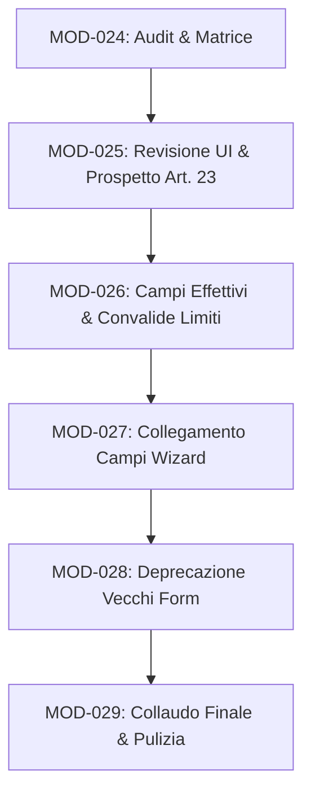

# Matrice Operativa Costituzione Fondo Dipendenti — MOD-024

Questo documento costituisce la matrice tecnica ed operativa per la preparazione del refactoring della pagina **Costituzione Fondo del personale dipendente** (`FondoAccessorioDipendentePage.tsx`) e il successivo raccordo controllato con il nuovo wizard **"Raccolta dati dell’Ente"** (Wizard 2026).

L'obiettivo è mappare in forma definitiva le corrispondenze logico-applicative, normativo-contrattuali e i vincoli di calcolo dell'**Art. 23, comma 2, D.Lgs. 75/2017**, prevenendo sovrascritture, duplicazioni o errate valutazioni dei limiti di spesa.

---

## 1. Baseline Tecnico del Working Tree

Di seguito viene riportato lo stato del working tree registrato tramite comandi git, al fine di isolare le modifiche correnti e documentare lo stato di partenza.

### 1.1 Stato del Repository (`git status`)
```
On branch feature/sprint-c4-1-wizard-base
Changes not staged for commit:
  (use "git add <file>..." to update what will be committed)
  (use "git restore <file>..." to discard changes in working directory)
	modified:   .env.example
	modified:   build-stats.html
	modified:   src/App.tsx
	modified:   src/application/registry/moduleRegistry.ts
	modified:   src/components/layout/Sidebar.tsx
	modified:   src/pages/FondoAccessorioDipendentePage.tsx

Untracked files:
  (use "git add <file>..." to include in what will be committed)
	docs/audit/sprint-c4-6-audit-completezza-wizard.md
	docs/refactoring/
	src/features/
	src/logic/wizard2026/

no changes added to commit (use "git add" and/or "git commit -a")
```

### 1.2 Statistiche delle modifiche (`git diff --stat`)
```
 .env.example                                |  1 +
 build-stats.html                            |  2 +-
 src/App.tsx                                 | 32 +++++++++++++++-
 src/application/registry/moduleRegistry.ts  | 20 +++++++++-
 src/components/layout/Sidebar.tsx           |  1 +
 src/pages/FondoAccessorioDipendentePage.tsx | 58 ++++++++++++++++++++++++++++-
 6 files changed, 110 insertions(+), 4 deletions(-)
```

### 1.3 Modifiche specifiche nei file logico-applicativi
- **`git diff -- src/pages/FondoAccessorioDipendentePage.tsx`**:
  Le modifiche in questo file corrispondono a quelle introdotte con la **MOD-022**:
  - Aggiunta dello stato locale `showTransferAlert` e dell'effetto per leggerne il valore da `sessionStorage`.
  - Implementazione della funzione `handleRollback` che recupera lo snapshot profondo da `sessionStorage` e fa il dispatch dell'azione `IMPORT_FUND_DATA` per ripristinare il `FundData` precedente.
  - Rendering del banner informativo premium in cima alla pagina con il pulsante *“Annulla trasferimento e ripristina dati precedenti”*.
- **`git diff -- src/logic/fundEngine.ts`**: `Nessuna modifica` (Working tree pulito).
- **`git diff -- src/logic/fundCalculations.ts`**: `Nessuna modifica` (Working tree pulito).
- **`git diff -- src/logic/fundFieldDefinitions.ts`**: `Nessuna modifica` (Working tree pulito).

> [!NOTE]
> Il working tree complessivo è qualificato come **SPORCO** in relazione ad alcune modifiche di contorno necessarie all'attivazione del modulo wizard e alla persistenza locale dei flag temporanei introdotta con la MOD-022, ma i motori di calcolo legacy (`fundEngine`, `fundCalculations` e le relative definizioni) sono perfettamente intatti e coerenti con la baseline di produzione.

---

## 2. Inventario dei Campi della Costituzione Fondo Dipendenti

La tabella seguente cataloga ogni singolo campo operante all'interno della costituzione del Fondo accessorio dipendenti (`FondoAccessorioDipendenteData`), tracciando la provenienza logica, la formula associata e l'editabilità:

| Sezione UI | Chiave tecnica | Etichetta visibile | File sorgente | Tipo campo | Formula/calcolo | Editabile sì/no | Note |
|---|---|---|---|---|---|---|---|
| **Stabili** | `st_art79c1_art67c1_unicoImporto2017` | Unico importo consolidato 2017 | `fundFieldDefinitions.ts` | Valore inserito | Storico consolidato | Sì | Base stabili dell'ente |
| **Stabili** | `st_art79c1_art67c1_alteProfessionalitaNonUtil` | Alte professionalità non utilizzate al 2017 | `fundFieldDefinitions.ts` | Valore inserito | Storico | Sì | Rileva se non già in unico importo |
| **Stabili** | `st_art79c1_art67c2a_incr8320` | Incremento €83,20 pro-capite (pers. 2015) | `fundFieldDefinitions.ts` | Valore inserito | €83,20 × dipendenti al 31.12.2015 | Sì | Calcolo storico fisso |
| **Stabili** | `st_art79c1_art67c2b_incrStipendialiDiff` | Incrementi stipendiali differenziali (Art. 64) | `fundFieldDefinitions.ts` | Valore inserito | Storico contrattuale 2018 | Sì | Fissato su base storica |
| **Stabili** | `st_art79c1_art4c2_art67c2c_integrazioneRIA` | Integrazione RIA personale cessato anno prec. | `fundFieldDefinitions.ts` | Valore inserito | Somma RIA cessati anno precedente | Sì | Ricostruito annualmente |
| **Stabili** | `st_art79c1_art67c2d_risorseRiassorbite165` | Risorse riassorbite (Art. 2 c.3 D.Lgs 165/01) | `fundFieldDefinitions.ts` | Valore inserito | Storico | Sì | Obsoleto/raro |
| **Stabili** | `st_art79c1_art15c1l_art67c2e_personaleTrasferito` | Risorse personale trasferito (decentramento) | `fundFieldDefinitions.ts` | Valore inserito | Quota concordata stabili | Sì | Trasferimento tra enti |
| **Stabili** | `st_art79c1_art15c1i_art67c2f_regioniRiduzioneDirig`| Regioni: riduzione stabile posti dirig. | `fundFieldDefinitions.ts` | Valore inserito | Fino a 0,2% MS Dirigenza | Sì | Solo per enti di tipo REGIONE |
| **Stabili** | `st_art79c1_art14c3_art67c2g_riduzioneStraordinario` | Riduzione stabile straordinario | `fundFieldDefinitions.ts` | A calcolo / Wizard | Popolato da Step 6 | Sì | Consolidato in parte stabile |
| **Stabili** | `st_art79c1b_euro8450` | Incremento €84,50 pro-capite (pers. 2018) | `fundFieldDefinitions.ts` | Valore inserito | €84,50 × dipendenti al 31.12.2018 | Sì | Fisso dal 2021 |
| **Stabili** | `st_art79c1c_incrementoStabileConsistenzaPers`| Incremento stabile (diff. consistenza) | `fundFieldDefinitions.ts` | Valore inserito | Storico | Sì | Escluso da Art. 23 |
| **Stabili** | `st_art79c1d_differenzialiStipendiali2022` | Differenziali stipendiali (Art. 78 CCNL 2022) | `fundFieldDefinitions.ts` | Valore inserito | Storico | Sì | Consolidato dal 2022 |
| **Stabili** | `st_art79c1bis_diffStipendialiB3D3` | Differenziali stipendiali posizioni B3 e D3 | `fundFieldDefinitions.ts` | Valore inserito | Storico | Sì | Conservazione |
| **Stabili** | `st_incrementoDecretoPA` | Incremento D.L. 75/2023 (Decreto PA bis) | `fundFieldDefinitions.ts` | Valore inserito | Storico | Sì | **Deprecato** (assorbito) |
| **Stabili** | `st_art58c1_CCNL2026_incremento014_MS2021` | Incremento stabile 0,14% Monte Salari 2021 | `fundFieldDefinitions.ts` | A calcolo / Wizard | MS 2021 × 0,14% | No | Alimentato da Step 4 |
| **Stabili** | `st_incrementoDL25_2025` | Incremento D.L. 25/2025 (soglia 48%) | `fundFieldDefinitions.ts` | Valore inserito | Scelta dell'ente (max = limite) | Sì | Limitato da Step 3 |
| **Stabili** | `st_taglioFondoDL78_2010` | Taglio fondo DL 78/2010 (se non in unico) | `fundFieldDefinitions.ts` | Riduzione stabile | Storico | Sì | Decurtazione permanente (-) |
| **Stabili** | `st_riduzioniPersonaleATA_PO_Esternalizzazioni` | Riduzioni per ATA, esternalizzazioni, ecc. | `fundFieldDefinitions.ts` | Riduzione stabile | Storico | Sì | Decurtazione permanente (-) |
| **Stabili** | `st_art67c1_decurtazionePO_AP_EntiDirigenza` | Decurtazione PO/AP enti con dirigenza | `fundFieldDefinitions.ts` | Riduzione stabile | Storico | Sì | Decurtazione permanente (-) |
| **Stabili** | `st_riduzionePerIncrementoEQ` | Riduzione per incremento risorse EQ | `fundFieldDefinitions.ts` | Riduzione stabile | Spostamento a EQ | No | Calcolo automatico (-) |
| **Stabili** | `st_art60c2_CCNL2026_decurtazioneIndennitaComparto`| Decurtazione per conglobamento comparto | `fundFieldDefinitions.ts` | Riduzione stabile | Tab. C × 12 × personale 1/1/26 | No | Alimentato da Step 5 (-) |
| **Stabili** | `st_riduzioneFondoStraordinario` | Riduzione stabile straordinario | `fundFieldDefinitions.ts` | Riduzione stabile | Spostamento a straordinario | No | Calcolo automatico (-) |
| **Variabili** | `vs_art4c3_art15c1k_art67c3c_recuperoEvasione` | Recupero evasione tributaria (ICI/IMU) | `fundFieldDefinitions.ts` | Valore inserito | Somma accertata/riscossa | Sì | Tributi |
| **Variabili** | `vs_art4c2_art67c3d_integrazioneRIAMensile` | Integrazione RIA cessati in corso d'anno | `fundFieldDefinitions.ts` | Valore inserito | Somma pro-rata mensile | Sì | Calcolo in anno |
| **Variabili** | `vs_art67c3g_personaleCaseGioco` | Risorse personale case da gioco | `fundFieldDefinitions.ts` | Valore inserito | Storico | Sì | Solo casinò |
| **Variabili** | `vs_art79c2b_max1_2MonteSalari1997` | Quota storica max 1,2% Monte Salari 1997 | `fundFieldDefinitions.ts` | Valore inserito | Monte Salari 1997 × 1,2% | Sì | Storico |
| **Variabili** | `vs_art67c3k_integrazioneArt62c2e_personaleTrasferito`| Quota variabile personale trasferito | `fundFieldDefinitions.ts` | Valore inserito | Quota concordata variabili | Sì | Trasferimento |
| **Variabili** | `vs_art79c2c_risorseScelteOrganizzative` | Stanziamento scelte organizzative / TD | `fundFieldDefinitions.ts` | Valore inserito | Deliberato in bilancio | Sì | Variabile generica |
| **Variabili**| `vn_art15c1d_art67c3a_sponsorConvenzioni` | Sponsorizzazioni, convenzioni, extra | `fundFieldDefinitions.ts` | Valore inserito | Entrate da terzi | Sì | Escluso |
| **Variabili**| `vn_art54_art67c3f_rimborsoSpeseNotifica` | Quota rimborso spese notifica (messi) | `fundFieldDefinitions.ts` | Valore inserito | Somma rimborsi riscossi | Sì | Escluso |
| **Variabili**| `vn_art15c1k_art16_dl98_art67c3b_pianiRazionalizzazione`| Piani di razionalizzazione Art. 16 DL 98 | `fundFieldDefinitions.ts` | Valore inserito | Economie certificate | Sì | Escluso |
| **Variabili**| `vn_art15c1k_art67c3c_incentiviTecniciCondoni` | Incentivi funzioni tecniche e condoni | `fundFieldDefinitions.ts` | Valore inserito | Quadro economico appalti | Sì | Escluso |
| **Variabili**| `vn_art18h_art67c3c_incentiviSpeseGiudizioCensimenti`| Incentivi avvocatura, ISTAT, censimenti | `fundFieldDefinitions.ts` | Valore inserito | Rimborsi accertati | Sì | Escluso |
| **Variabili**| `vn_art15c1m_art67c3e_risparmiStraordinario` | Risparmi straordinario anno precedente | `fundFieldDefinitions.ts` | A calcolo / Wizard | Economie certificate Step 6 | Sì | Alimentato da Step 6 (Escluso) |
| **Variabili**| `vn_art67c3j_regioniCittaMetro_art23c4_incrPercentuale`| Incremento % Regioni e Città Metropolitane | `fundFieldDefinitions.ts` | Valore inserito | Storico | Sì | Escluso (solo REG/CM) |
| **Variabili**| `vn_art80c1_sommeNonUtilizzateStabiliPrec` | Avanzi stabili trascinati | `fundFieldDefinitions.ts` | Valore inserito | Avanzo vincolato da rendiconto | Sì | Escluso |
| **Variabili**| `vn_l145_art1c1091_incentiviRiscossioneIMUTARI`| Incentivi riscossione IMU/TARI | `fundFieldDefinitions.ts` | Valore inserito | Entrate da accertamenti | Sì | Escluso |
| **Variabili**| `vn_l178_art1c870_risparmiBuoniPasto2020` | Risparmi buoni pasto 2020 | `fundFieldDefinitions.ts` | Valore inserito | Storico | Sì | **Deprecato** |
| **Variabili**| `vn_dl135_art11c1b_risorseAccessorieAssunzioniDeroga`| Risorse accessorie assunzioni in deroga | `fundFieldDefinitions.ts` | Valore inserito | Storico | Sì | Escluso |
| **Variabili**| `vn_art79c3_022MonteSalari2018_da2022Proporzionale`| 0,22% MS 2018 proporzionale | `fundFieldDefinitions.ts` | Valore inserito | Storico | Sì | **Deprecato** |
| **Variabili**| `vn_art79c1b_euro8450_unaTantum2021_2022` | Una tantum €84,50 (anni 2021-2022) | `fundFieldDefinitions.ts` | Valore inserito | Scaduto | Sì | **Da eliminare** |
| **Variabili**| `vn_art79c3_022MonteSalari2018_da2022UnaTantum2022` | Una tantum 0,22% (anno 2022) | `fundFieldDefinitions.ts` | Valore inserito | Scaduto | Sì | **Da eliminare** |
| **Variabili**| `vn_dl13_art8c3_incrementoPNRR_max5stabile2016` | Incremento PNRR (max 5% stabile 2016) | `fundFieldDefinitions.ts` | Valore inserito | Stanziamento effettivo (max=limite) | Sì | Limitato da Step 7 (Escluso) |
| **Variabili**| `vn_art58c2_incremento_max022_ms2021` | Incremento max 0,22% MS 2021 | `fundFieldDefinitions.ts` | Valore inserito | Scelta dell'ente (max = limite) | Sì | Limitato da Step 4 (Escluso) |
| **Variabili**| `vn_art58c2_incremento_max022_ms2021_anno2025`| Incremento 0,22% MS 2021 (anno 2025) | `fundFieldDefinitions.ts` | Valore inserito | Storico/Calcolato | Sì | Arretrati 0,22% (Escluso) |
| **Variabili**| `vn_art58_CCNL2026_arretrati2024_2025` | Arretrati 2024-2025 (una tantum 0,14%) | `fundFieldDefinitions.ts` | A calcolo / Wizard | MS 2021 × 0,14% × 2 | No | Alimentato da Step 4 (Escluso) |
| **Finali** | `fin_art4_dl16_misureMancatoRispettoVincoli` | Misure per mancato rispetto vincoli (DL 16) | `fundFieldDefinitions.ts` | Riduzione stabile | Decurtazione sanzionatoria | Sì | Voce negativa (-) |
| **Limiti** | `cl_art23c2_decurtazioneIncrementoAnnualeTetto2016` | Decurtazione per rispetto tetto 2016 | `fundFieldDefinitions.ts` | Rettifica interna | Sforamento calcolato su tetto 2016 | No | Taglio automatico (-) |
| **Limiti** | `cl_totaleParzialeRisorsePerConfrontoTetto2016` | Totale parziale risorse per confronto tetto | `fundFieldDefinitions.ts` | Aggregato calcolato | Somma voci rilevanti FAD + Straord + EQ | No | Controllo generale |

---

## 3. Classificazione Voce per Voce ai fini dell’Art. 23, comma 2, D.Lgs. 75/2017

Ciascuna voce presente all'interno del modello dati del Fondo Dipendenti viene di seguito classificata secondo i criteri normativi definiti per la verifica del tetto di spesa 2016:

### 3.1 DENTRO_LIMITE
Risorse che concorrono direttamente all'ammontare accessorio annuo soggetto al limite di spesa:
- `st_art79c1_art67c1_unicoImporto2017`: Base storica consolidata fissa del fondo. *Motivazione: costituisce il nucleo delle risorse accessorie ordinarie.*
- `st_art79c1_art67c1_alteProfessionalitaNonUtil`: Quota non spesa per le PO. *Motivazione: fa parte della spesa stabile ordinaria.*
- `st_art79c1_art4c2_art67c2c_integrazioneRIA`: RIA dei cessati anni precedenti. *Motivazione: l'integrazione stabile incrementa la capacità di spesa accessoria ordinaria.*
- `st_art79c1_art67c2d_risorseRiassorbite165`: Quote da riorganizzazioni. *Motivazione: confluite in parte stabile.*
- `st_art79c1_art15c1l_art67c2e_personaleTrasferito`: Quote stabili di mobilità. *Motivazione: rappresenta trasferimento di limite tra enti locali.*
- `st_art79c1_art15c1i_art67c2f_regioniRiduzioneDirig`: Quota minori oneri. *Motivazione: specifico spostamento di limite interno alla dirigenza.*
- `st_art79c1_art14c3_art67c2g_riduzioneStraordinario`: Spostamento dallo straordinario a stabili FAD. *Motivazione: lo straordinario ridotto è un consolidamento stabile soggetto al tetto complessivo.*
- `st_incrementoDL25_2025` (effettivo): Spesa per l'armonizzazione. *Motivazione: il D.L. 25/2025 specifica che tali risorse rilevano a tutti gli effetti ai fini del limite dell'art. 23 comma 2.*
- `vs_art4c3_art15c1k_art67c3c_recuperoEvasione` (ICI/IMU): Entrate da recupero evasione. *Motivazione: l'Aran ha chiarito che il recupero ICI/IMU destinato al fondo variabile concorre al tetto.*
- `vs_art4c2_art67c3d_integrazioneRIAMensile`: RIA pro-rata cessati in anno. *Motivazione: incremento variabile soggetto a limite.*
- `vs_art67c3g_personaleCaseGioco`: Case da gioco. *Motivazione: spesa accessoria finanziata dall'ente.*
- `vs_art79c2b_max1_2MonteSalari1997`: Risorsa storica MS 1997. *Motivazione: quota variabile ordinaria soggetta.*
- `vs_art67c3k_integrazioneArt62c2e_personaleTrasferito`: Mobilità quota variabile. *Motivazione: spesa accessoria corrente.*
- `vs_art79c2c_risorseScelteOrganizzative`: Variabile da CCDI. *Motivazione: quota discrezionale soggetta a limite.*

### 3.2 FUORI_LIMITE_DEROGA
Risorse variabili o stabili escluse dal calcolo del tetto per specifica deroga normativa o contrattuale:
- `st_art79c1_art67c2a_incr8320` e `st_art79c1b_euro8450`: Risorse contrattuali fisse escluse a monte dai CCNL 2018 e 2022. *Motivazione: specifica deroga inserita nei contratti collettivi nazionali per finanziare i rinnovi.*
- `st_art79c1_art67c2b_incrStipendialiDiff` e `st_art79c1d_differenzialiStipendiali2022`: Differenziali stipendiali maturati. *Motivazione: esclusione contrattuale per i differenziali stipendiali ex art. 64 (2018) e art. 78 (2022).*
- `st_art79c1c_incrementoStabileConsistenzaPers` e `st_art79c1bis_diffStipendialiB3D3`: Variazioni stabili. *Motivazione: escluse contrattualmente.*
- `st_art58c1_CCNL2026_incremento014_MS2021`: Incremento 0,14% stabili. *Motivazione: l'art. 58 comma 4 del CCNL 23.02.2026 sancisce espressamente che tale incremento è escluso dall'art. 23 c.2.*
- `vn_art58_CCNL2026_arretrati2024_2025`: Arretrati 0,14%. *Motivazione: arretrati contrattuali del rinnovo esclusi ex lege.*
- `vn_art58c2_incremento_max022_ms2021` (e anno 2025): Quota 0,22% MS 2021. *Motivazione: l'art. 58 comma 4 del CCNL 23.02.2026 esclude espressamente la quota dello 0,22% dal tetto.*
- `vn_dl13_art8c3_incrementoPNRR_max5stabile2016` (effettivo): Incentivi PNRR. *Motivazione: l'art. 8 comma 3 del D.L. 13/2023 dispone l'espressa esclusione dal limite per le quote entro il 5% del fondo.*
- `vn_art15c1d_art67c3a_sponsorConvenzioni` e `vn_art54_art67c3f_rimborsoSpeseNotifica`: Sponsor e rimborsi notifiche. *Motivazione: risorse interamente finanziate da terzi o da utenza esterna.*
- `vn_art15c1k_art16_dl98_art67c3b_pianiRazionalizzazione`: Risparmi di spesa. *Motivazione: deroga per piani di razionalizzazione certificati.*
- `vn_art15c1k_art67c3c_incentiviTecniciCondoni` (tecnici post-2018): *Motivazione: la Corte dei Conti ed il D.Lgs. 36/2023 escludono gli incentivi tecnici dal salario accessorio rilevante.*
- `vn_art18h_art67c3c_incentiviSpeseGiudizioCensimenti`: Avvocatura e ISTAT. *Motivazione: rimborsi e competenze ex lege esclusi dal tetto.*
- `vn_art15c1m_art67c3e_risparmiStraordinario`: Avanzo da straordinario. *Motivazione: risorse già transitate per lo straordinario (che è a monte soggetto a limite).*
- `vn_art80c1_sommeNonUtilizzateStabiliPrec`: Avanzo stabili. *Motivazione: risorse già assoggettate al limite nell'anno di provenienza.*
- `vn_l145_art1c1091_incentiviRiscossioneIMUTARI`: Recupero IMU/TARI. *Motivazione: deroga specifica ex L. 145/2018.*
- `vn_dl135_art11c1b_risorseAccessorieAssunzioniDeroga`: Assunzioni in deroga. *Motivazione: risorse accessorie collegate ad assunzioni straordinarie escluse per legge.*

### 3.3 FIGURATIVO_ART23
- `st_art60c2_CCNL2026_decurtazioneIndennitaComparto` (Decurtazione conglobamento compartments): *Motivazione: ai sensi dell'art. 60 comma 2, la decurtazione riduce realmente la parte stabile del fondo (il fondo accessorio effettivo cala), ma a livello di limite Art. 23 deve essere considerata figurativamente come spesa ancora attiva. Questo evita di ridurre artificialmente il limite dell'ente, mantenendo la neutralità finanziaria del tetto (l'ente spende la quota sui tabellari invece che sulle indennità).*

### 3.4 CONTROL_ONLY
- `cl_art23c2_decurtazioneIncrementoAnnualeTetto2016` e `cl_totaleParzialeRisorsePerConfrontoTetto2016`: *Motivazione: campi calcolati dal motore di calcolo per verificare se il limite è stato superato ed applicare l'eventuale decurtazione. Non sono risorse disponibili.*

### 3.5 PARAMETRO_ISTRUTTORIO
- Parametri come Monte Salari 2021, FTE dipendenti, tetti storici, ecc. *Motivazione: dati inseriti per far funzionare i calcoli, non voci della costituzione.*

### 3.6 NON_RILEVANTE
- `fin_art4_dl16_misureMancatoRispettoVincoli` (Sanzione): *Motivazione: decurtazione reale e contabile esterna dovuta a sanzioni, non incide sulle regole ordinarie di limite.*

---

## 4. Confronto tra Foglio Excel e Pagina Costituzione Fondo

Dall'analisi del file Excel `comparto` ( Row 1-325 ) e della configurazione dell'applicazione `fundFieldDefinitions.ts`, emergono le seguenti concordanze e discrepanze:

| Voce Excel | Voce App corrispondente | Chiave tecnica App | Presente in App sì/no | Coerenza Art. 23 | Differenza rilevata | Azione proposta |
|---|---|---|---|---|---|---|
| **Unico importo consolidato 2017** (Row 4) | Unico importo consolidato 2017 | `st_art79c1_art67c1_unicoImporto2017` | Sì | Coerente | Nessuna | Mantenere |
| **Alte professionalità 0,20%** (Row 5) | Alte professionalità non utilizzate | `st_art79c1_art67c1_alteProfessionalitaNonUtil` | Sì | Coerente | Nessuna | Mantenere |
| **Incremento €83,20** (Row 6) | Incremento €83,20 pro-capite | `st_art79c1_art67c2a_incr8320` | Sì | Coerente | Nessuna | Mantenere |
| **Differenziali art. 64** (Row 7) | Incrementi stipendiali differenziali | `st_art79c1_art67c2b_incrStipendialiDiff` | Sì | Coerente | Nessuna | Mantenere |
| **Integrazione RIA** (Row 8) | Integrazione RIA cessati anno prec. | `st_art79c1_art4c2_art67c2c_integrazioneRIA` | Sì | Coerente | Nessuna | Mantenere |
| **Risorse riassorbite art. 2 c.3** (Row 9) | Risorse riassorbite ex 165 | `st_art79c1_art67c2d_risorseRiassorbite165` | Sì | Coerente | Nessuna | Mantenere |
| **Personale trasferito** (Row 10) | Risorse personale trasferito | `st_art79c1_art15c1l_art67c2e_personaleTrasferito` | Sì | Coerente | Nessuna | Mantenere |
| **Regioni: riduzione posti** (Row 11) | Regioni: riduzione stabile dirig. | `st_art79c1_art15c1i_art67c2f_regioniRiduzioneDirig` | Sì | Coerente | Nessuna | Mantenere |
| **Riduzione stabile straordinario** (Row 12) | Riduzione stabile straordinario | `st_art79c1_art14c3_art67c2g_riduzioneStraordinario` | Sì | Coerente | Nessuna | Mantenere |
| **Taglio fondo D.L. 78/2010** (Row 13) | Taglio fondo DL 78/2010 | `st_taglioFondoDL78_2010` | Sì | Coerente | Nessuna | Mantenere |
| **Riduzioni ATA, PO, esternalizzazioni** (Row 14) | Riduzioni per ATA, esternalizzazioni | `st_riduzioniPersonaleATA_PO_Esternalizzazioni` | Sì | Coerente | Nessuna | Mantenere |
| **Decurtazione PO/AP enti con dirigenza** (Row 15) | Decurtazione PO/AP enti con dirigenza | `st_art67c1_decurtazionePO_AP_EntiDirigenza` | Sì | Coerente | Nessuna | Mantenere |
| **Euro 84,50 pers. 2018** (Row 16) | Incremento €84,50 pro-capite | `st_art79c1b_euro8450` | Sì | Coerente | Nessuna | Mantenere |
| **Incremento consistenza pers.** (Row 17) | Incremento stabile | `st_art79c1c_incrementoStabileConsistenzaPers` | Sì | Coerente | Nessuna | Mantenere |
| **Differenziali stip. 2022** (Row 18) | Differenziali stipendiali | `st_art79c1d_differenzialiStipendiali2022` | Sì | Coerente | Nessuna | Mantenere |
| **Differenziali B3/D3** (Row 19) | Differenziali stipendiali B3/D3 | `st_art79c1bis_diffStipendialiB3D3` | Sì | Coerente | Nessuna | Mantenere |
| **Incremento 0,14% MS 2021** (Row 20) | Incremento stabile 0,14% | `st_art58c1_CCNL2026_incremento014_MS2021` | Sì | Coerente | Nessuna | Mantenere |
| **Risorse D.L. 25/2025** (Row 21) | Incremento D.L. 25/2025 | `st_incrementoDL25_2025` | Sì | Coerente | Excel include l'art. 14 comma 1-bis; l'app mappa il valore come suggerito. | Mantenere come campo di input dell'effettivo. |
| **Decurtazione comparto Art. 60** (Row 22) | Decurtazione stabile comparto | `st_art60c2_CCNL2026_decurtazioneIndennitaComparto` | Sì | Incoerenza nel codice | Nel codice partecipa come sottrattore reale stabili ma è esclusa per il calcolo del limite (figurativa). | Rendere chiara la duplicità (Reale vs Figurativa) |
| **Recupero evasione ICI/IMU** (Row 26) | Recupero evasione ICI/IMU | `vs_art4c3_art15c1k_art67c3c_recuperoEvasione` | Sì | Coerente | Nessuna | Mantenere |
| **RIA cessati in corso d'anno** (Row 27) | Integrazione RIA cessati in anno | `vs_art4c2_art67c3d_integrazioneRIAMensile` | Sì | Coerente | Nessuna | Mantenere |
| **Personale case da gioco** (Row 28) | Risorse personale case gioco | `vs_art67c3g_personaleCaseGioco` | Sì | Coerente | Nessuna | Mantenere |
| **Max 1,2% MS 1997** (Row 29) | Max 1,2% Monte Salari 1997 | `vs_art79c2b_max1_2MonteSalari1997` | Sì | Coerente | Nessuna | Mantenere |
| **Personale trasferito (variabile)** (Row 30) | Quota variabile pers. trasferito | `vs_art67c3k_integrazioneArt62c2e_personaleTrasferito` | Sì | Coerente | Nessuna | Mantenere |
| **Scelte organizzative / TD** (Row 31) | Risorse scelte organizzative | `vs_art79c2c_risorseScelteOrganizzative` | Sì | Coerente | Nessuna | Mantenere |
| **Sponsor e convenzioni** (Row 39) | Sponsorizzazioni, convenzioni | `vn_art15c1d_art67c3a_sponsorConvenzioni` | Sì | Coerente | Nessuna | Mantenere |
| **Rimborso notifica messi** (Row 40) | Quota rimborso notifica messi | `vn_art54_art67c3f_rimborsoSpeseNotifica` | Sì | Coerente | Nessuna | Mantenere |
| **Piani razionalizzazione** (Row 41) | Piani di razionalizzazione | `vn_art15c1k_art16_dl98_art67c3b_pianiRazionalizzazione` | Sì | Coerente | Nessuna | Mantenere |
| **Incentivi tecnici, condoni** (Row 42) | Incentivi funzioni tecniche | `vn_art15c1k_art67c3c_incentiviTecniciCondoni` | Sì | Coerente | Nel file Excel include art. 45 D.Lgs. 36/23, condoni, centralinisti non vedenti; l'app ha anche l'utilizzo. | **Razionalizzare**: separare incentivi tecnici ex art. 45. |
| **Giudizi favorevoli e ISTAT** (Row 43) | Incentivi avvocatura, ISTAT | `vn_art18h_art67c3c_incentiviSpeseGiudizioCensimenti` | Sì | Coerente | Nessuna | Mantenere |
| **Risparmi straordinario** (Row 44) | Risparmi straordinario | `vn_art15c1m_art67c3e_risparmiStraordinario` | Sì | Coerente | Nessuna | Mantenere |
| **Incremento % Regioni/CM** (Row 45) | Regioni/Città Metro: Incr. % | `vn_art67c3j_regioniCittaMetro_art23c4_incrPercentuale` | Sì | Coerente | Nessuna | Mantenere |
| **Somme non utilizzate stabili** (Row 46) | Somme non utilizzate | `vn_art80c1_sommeNonUtilizzateStabiliPrec` | Sì | Coerente | Nessuna | Mantenere |
| **Incentivi IMU/TARI** (Row 47) | Incentivi riscossione IMU/TARI | `vn_l145_art1c1091_incentiviRiscossioneIMUTARI` | Sì | Coerente | Nessuna | Mantenere |
| **Risparmi buoni pasto 2020** (Row 48) | Risparmi buoni pasto 2020 | `vn_l178_art1c870_risparmiBuoniPasto2020` | Sì | Coerente | Non più attuale (temporanea 2020) | **Deprecare** |
| **Assunzioni in deroga** (Row 49) | Risorse assunzioni in deroga | `vn_dl135_art11c1b_risorseAccessorieAssunzioniDeroga` | Sì | Coerente | Nessuna | Mantenere |
| **0,22% MS 2018** (Row 50) | 0,22% MS 2018 proporzionale | `vn_art79c3_022MonteSalari2018_da2022Proporzionale` | Sì | Coerente | Non più attuale (storicizzata) | **Deprecare** |
| **PNRR max 5%** (Row 51) | Incremento PNRR | `vn_dl13_art8c3_incrementoPNRR_max5stabile2016` | Sì | Coerente | Excel include l'art. 8 c.3; l'app mappa il valore come limite massimo. | Mantenere come limite e aggiungere l'input effettivo. |
| **Arretrati 2024-25 (0,14%)** (Row 52) | Arretrati 2024-25 (0,14%) | `vn_art58_CCNL2026_arretrati2024_2025` | Sì | Coerente | Nessuna | Mantenere |
| **Incremento 0,22% MS 2021** (Row 53) | Incremento max 0,22% MS 2021 | `vn_art58c2_incremento_max022_ms2021` | Sì | Coerente | Excel riporta la decorrenza 2024; l'app lo ha come suggerito. | Mantenere come campo di input dell'effettivo. |
| **Incremento 0,22% (arretrati 2025)** (Row 54) | Incremento 0,22% (anno 2025) | `vn_art58c2_incremento_max022_ms2021_anno2025` | Sì | Coerente | Una tantum per anno 2025 | Mantenere |

---

## 5. Collegamento con i Dati Raccolti dal Nuovo Wizard

Il raccordo dei dati estratti dallo stato del wizard (`wizard2026DraftState`) ed importati nel `FundData` reale segue queste regole:

| Step Wizard | Dato Wizard | Valore prodotto | Campo Costituzione Fondo destinatario | Tipo trasferimento | Note |
|---|---|---|---|---|---|
| **Step 2** | Limite Art. 23 base 2016 | Cifra certificata | `historicalData.manualPersonalFundLimit2016` | Sola Lettura / Controllo | Limite storico di base dell'ente |
| **Step 2** | Limite Art. 23 attualizzato | Cifra attualizzata | `N/A` (Dato di controllo generale) | Sola Lettura / Controllo | Tetto complessivo del trattamento accessorio |
| **Step 3** | Limite massimo D.L. 25/2025 | Spazio lordo 48% | `N/A` (Dato di controllo) | Sola Lettura / Controllo | Soglia massima teorica calcolata dal wizard |
| **Step 3** | Importo effettivo D.L. 25/2025 | Quota scelta | `st_incrementoDL25_2025_effettivo` (Nuovo) | **Manuale (Validato)** | L'utente inserisce la quota reale, validata $\le$ Limite |
| **Step 4** | Incremento stabile 0,14% | Quota fissa | `st_art58c1_CCNL2026_incremento014_MS2021` | **Automatico** | Scritto in parte stabile, escluso Art. 23 |
| **Step 4** | Arretrati 0,14% (2024-25) | Quota una tantum | `vn_art58_CCNL2026_arretrati2024_2025` | **Automatico** | Scritto in parte variabile una tantum, escluso |
| **Step 4** | Limite massimo 0,22% MS 2021 | Quota max | `N/A` (Dato di controllo) | Sola Lettura / Controllo | Tetto massimo opzionale dello 0,22% |
| **Step 4** | Incremento effettivo 0,22% Fondo | Quota scelta ripartita | `vn_art58c2_incremento_max022_ms2021` | **Manuale (Validato)** | L'utente inserisce la quota reale, validata $\le$ Ripartito |
| **Step 4** | Incremento effettivo 0,22% EQ | Quota scelta ripartita | `va_incremento022_ms2021_eq` (in EQ) | **Automatico** | Quota proporzionale destinata alle EQ |
| **Step 5** | Riduzione permanente Art. 60 | Quota calcolata | `st_art60c2_CCNL2026_decurtazioneIndennitaComparto` | **Automatico** | Decurtazione stabile reale, figurativa Art. 23 |
| **Step 6** | Riduzione stabile straordinario | Quota scelta | `st_art79c1_art14c3_art67c2g_riduzioneStraordinario`| **Automatico** | Spostamento stabile soggetto a limite |
| **Step 6** | Economie straordinario | Quota risparmi | `vn_art15c1m_art67c3e_risparmiStraordinario` | **Automatico** | Riversamento in variabile una tantum, escluso |
| **Step 6** | Straordinario ordinario residuo | Quota residua | `annualData.fondoLavoroStraordinario` | **Automatico** | Spesa straordinario ordinario dell'anno |
| **Step 7** | Limite massimo PNRR Dipendenti | 5% stabile 2016 | `N/A` (Dato di controllo) | Sola Lettura / Controllo | Soglia max incentivi escluse |
| **Step 7** | Importo effettivo PNRR Dipendenti | Quota scelta | `vn_dl13_art8c3_incrementoPNRR_effettivo` (Nuovo) | **Manuale (Validato)** | Inserimento manuale dell'ente, validato $\le$ Limite |

---

## 6. Proposta di Revisione della Pagina Costituzione Fondo Dipendenti

Si propone una profonda riorganizzazione dell'interfaccia utente (`FondoAccessorioDipendentePage.tsx`) volta a massimizzare la leggibilità, ad evidenziare i vincoli normativi ed a raggruppare i dati secondo la loro reale natura contrattuale.

### Sezione A — Baseline e Parametri Istruttori
- **Finalità**: Mostrare i parametri strutturali dell'anno in corso ereditati dal wizard (sola lettura) che guidano i calcoli automatici.
- **Campi**: Anno di riferimento, Monte Salari 2021, FTE personale 2018, FTE personale corrente.
- **Editabilità**: *Read-only*.
- **Help Text**: *"I parametri mostrati in questa sezione sono stati compilati all'interno della Raccolta dati dell'Ente e non sono modificabili da questa schermata."*

### Sezione B — Risorse Stabili
- **Finalità**: Visualizzare i componenti permanenti del fondo, distinguendo le entrate lorde, i detratori reali stabili e il saldo stabile.
- **Sotto-Sezione 1: Entrate Stabili**:
  - Campi: Unico consolidato 2017, RIA cessati prec., incremento 0,14% stabile (automatico read-only), incremento stabile straordinario (automatico read-only).
- **Sotto-Sezione 2: Detratori Stabili (Decurtazioni permanenti)**:
  - Campi: Taglio DL 78/2010, Decurtazione comparto Art. 60 (automatico read-only), Spostamento a EQ (automatico), Spostamento a Straordinario (automatico).
- **Validazioni**: Allerta se la somma stabili supera i valori storici registrati.

### Sezione C — Risorse Variabili Soggette al Limite
- **Finalità**: Mostrare le risorse stanziate su base discrezionale dall'ente che erodono lo spazio del limite dell'Art. 23.
- **Campi**: Recupero evasione tributaria (ICI/IMU), RIA cessati in anno pro-rata, scelte organizzative/politiche retributive (CCDI).
- **Editabilità**: *Sempre manuale*.

### Sezione D — Risorse Variabili Escluse dal Limite (in deroga)
- **Finalità**: Evidenziare la quota di salario accessorio variabile che l'ente può erogare oltre il limite dell'Art. 23.
- **Campi**: Sponsor e convenzioni, Rimborsi notifiche, Economie straordinario, Avanzi stabili trascinati, Incentivi tributi L. 145/2018.
- **Campi controllati (con limite massimo)**:
  - **Incentivi PNRR**: Campo manuale `vn_dl13_art8c3_incrementoPNRR_effettivo`, con visualizzazione a fianco del limite massimo del 5% ereditato dal wizard. Validazione bloccante se l'inserito eccede il massimo.
  - **Quota 0,22% MS 2021**: Campo manuale `vn_art58c2_incremento_max022_ms2021_effettivo` con visualizzazione della quota massima proporzionale. Validazione bloccante.
  - **Arretrati contrattuali (0,14%)**: Campo automatico `vn_art58_CCNL2026_arretrati2024_2025` (*read-only*).
  - **D.L. 25/2025 (effettivo)**: Campo manuale `st_incrementoDL25_2025_effettivo` con visualizzazione del limite massimo calcolato dal wizard. Validazione bloccante.

### Sezione E — Riepilogo per Revisori e Organi di Controllo
- **Finalità**: Prospetto sintetico per la certificazione del fondo (vedi par. 7).

---

## 7. Prospetto Riepilogativo Art. 23 da Implementare

Si propone la sostituzione del vecchio pannello limiti con un prospetto analitico diviso in 4 macro-aree, configurato per garantire la quadratura formale e la trasparenza dinanzi al collegio dei revisori:

```
+----------------------------------------------------------------------------------------+
|                      PROSPETTO DI VERIFICA COMPLIANCE ART. 23 c. 2                     |
+----------------------------------------------------------------------------------------+
| 1. DETERMINAZIONE DEL TETTO MASSIMO DI SPESA                                           |
|    - Limite storico base 2016 (certificato/asseverato):                 € [ 2016_Base ]|
|    - Adeguamento variazione personale (pro-capite 2018 * delta FTE):    € [ Adj_Fte   ]|
|    = LIMITE ART. 23 ATTUALIZZATO (TETTO DI SPESA):                      € [ Tetto_Tot ]|
+----------------------------------------------------------------------------------------+
| 2. CALCOLO DELLA SPESA ACCESSORIA SOGGETTA A LIMITE                                    |
|    - Risorse stabili soggette (al netto delle riduzioni, escluso Art.60)€ [ Stab_Sogg ]|
|    - Risorse variabili soggette (ICI/IMU, RIA, CCDI):                   € [ Var_Sogg  ] |
|    - Spesa straordinario ordinario dell'anno (soggetta):                € [ Stra_Ord  ]|
|    - Risorse stabili destinate alle Elevate Qualificazioni (soggette):  € [ Eq_Sogg   ]|
|    - Quota figurativa di neutralità Art. 60 (re-add):                  € [ Comparto  ]|
|    = TOTALE SPESA ACCESSORIA SOGGETTA AL TETTO:                         € [ Spesa_Sog ]|
+----------------------------------------------------------------------------------------+
| 3. RISORSE ESCLUSE (A FINI INFORMATIVI)                                                |
|    - Totale risorse variabili escluse dal tetto (PNRR, 0.22%, etc.):    € [ Escl_Tot  ]|
+----------------------------------------------------------------------------------------+
| 4. VERIFICA DI CONFORMITA' E SCOSTAMENTO                                               |
|    - Margine di sicurezza residuo / Scostamento (Tetto - Spesa):       € [ Delta_Val ]|
|    = STATO COMPLIANCE: [ CONFORME (Verde) / ATTENZIONE (Giallo) / SUPERAMENTO (Rosso) ]|
+----------------------------------------------------------------------------------------+
```

### Formule di Calcolo:
- `Tetto_Tot` = `2016_Base` + `Adj_Fte` (dove `Adj_Fte` = $\max(0, \text{ProCapite2018} \times (\text{FTE\_Corrente} - \text{FTE\_2018})$).
- `Spesa_Sog` = $\sum(\text{Stabili\_Soggette\_Reali}) + \sum(\text{Variabili\_Soggette}) + \text{Straordinario\_Ordinario} + \text{EQ\_Soggette} + \text{Decurtazione\_Comparto\_Art\_60}$.
  - *Nota*: La decurtazione `st_art60c2_CCNL2026_decurtazioneIndennitaComparto` entra con segno positivo in questa somma (re-add) per ripristinare il valore figurativo al lordo ai fini del tetto di spesa.
- `Delta_Val` = `Tetto_Tot` - `Spesa_Sog`.
- **Stato Compliance**:
  - `CONFORME`: se `Delta_Val` $\ge 0$ (margine disponibile).
  - `ATTENZIONE`: se `Delta_Val` $\ge 0$ ma inferiore all'1% del tetto (margine in esaurimento).
  - `SUPERAMENTO`: se `Delta_Val` $< 0$. Blocca l'approvazione del fondo.

---

## 8. Voci da Correggere, Rinominare, Deprecare o Eliminare

### A. Voci da correggere subito
1. **Chiave unica incentivi tecnici (`vn_art15c1k_art67c3c_incentiviTecniciCondoni`)**:
   - *Errore*: Aggrega impropriamente incentivi tecnici del D.Lgs. 36/2023, condoni storici, repressione illeciti edilizi e centralinisti non vedenti in un unico campo di risorsa.
   - *Correzione*: Separare gli incentivi tecnici in una risorsa autonoma chiamata `vn_incentiviFunzioniTecniche_art45` ed i centralinisti non vedenti in `vn_indennitaCentralinisti_art49`.
2. **Esclusione implicita decurtazione comparto (`st_art60c2_CCNL2026_decurtazioneIndennitaComparto`)**:
   - *Errore*: Configurato come `isRelevantToArt23Limit: true` in `strutturaFondo.json` ma poi escluso via codice nell'aggregatore `sommaStabiliSoggetteLimite`.
   - *Correzione*: Allineare la configurazione e trattarlo esplicitamente come risorsa a computo figurativo re-introdotto nella formula del tetto.

### B. Voci da rinominare
1. `vs_art79c2c_risorseScelteOrganizzative`: Rinominare in *"Risorse variabili per scelte organizzative e politiche retributive (CCDI)"*.
2. `vn_art15c1k_art16_dl98_art67c3b_pianiRazionalizzazione`: Rinominare in *"Risparmi da Piani di Razionalizzazione e Riqualificazione Spesa (Art. 16 DL 98/2011)"*.
3. `vn_art18h_art67c3c_incentiviSpeseGiudizioCensimenti`: Rinominare in *"Compensi Censimento ISTAT e spese giudizio avvocatura (esclusi)"*.
4. `st_riduzioniPersonaleATA_PO_Esternalizzazioni`: Rinominare in *"Riduzioni stabili per ATA, esternalizzazioni o trasferimenti di personale"*.

### C. Voci da deprecare
1. `st_incrementoDecretoPA` (D.L. 75/2023 - Decreto PA bis): Da disattivare nell'interfaccia in quanto risorsa stabile superata ed assorbita dai calcoli di D.L. 25/2025.
2. `vn_art79c3_022MonteSalari2018_da2022Proporzionale` (Quota 0,22% MS 2018): Da deprecare in quanto quota variabile storica ormai confluita e consolidata in parte stabile.

### D. Voci eliminabili solo dopo collaudo
1. `vn_art79c1b_euro8450_unaTantum2021_2022` (Una tantum scaduta): Rimozione definitiva dopo validazione.
2. `vn_art79c3_022MonteSalari2018_da2022UnaTantum2022` (Una tantum scaduta): Rimozione definitiva dopo validazione.

---

## 9. Rischi Tecnici da Presidiare

### 9.1 Ricalcoli silenti da `useEffect` legacy
La pagina `FondoAccessorioDipendentePage.tsx` ricalcola dinamicamente le voci del CCNL all'apertura. Se il wizard inserisce solo i valori contabili finali ma non aggiorna i campi sorgente nel context (`annualData.ccnl2024.monteSalari2021` o `ivcConglobation`), i `useEffect` azzereranno o ricalcoleranno i campi trasferiti al primo rendering.
- *Presidio*: Il trasferimento deve sincronizzare obbligatoriamente sia i valori contabili sia i parametri istruttori da cui dipendono.

### 9.2 Confusione tra Massimali e Importi Effettivi
Rischio che l'utente interpreti il limite massimo calcolato dal wizard per D.L. 25/2025 o PNRR come importo realmente costituito, gonfiando la spesa.
- *Presidio*: Creazione di chiavi distinte per i limiti e per gli inserimenti effettivi, con validazione bloccante: `valore_effettivo` $\le$ `valore_limite`.

### 9.3 Errata valutazione della neutralità dell'Art. 60
Se la riduzione comparto non viene reinserita figurativamente a livello di limite, l'ente sforerà il tetto del salario accessorio o bloccherà l'erogazione dei tabellari.
- *Presidio*: La formula di `sommaStabiliSoggetteLimite` deve incorporare il re-add figurativo dell'Art. 60.

### 9.4 Rollback e Snapshot di sessione
Il meccanismo di rollback deve garantire il ripristino profondo.
- *Presidio*: Utilizzo di `structuredClone` prima dell'applicazione del payload, con flag e snapshot salvati in `sessionStorage` in forma serializzata.

---

## 10. Proposta di Sequenza Implementativa

Si propone la pianificazione della sequenza evolutiva divisa in 5 MOD consecutive:



### MOD-025: Revisione UI e Riepilogo Art. 23
- **Obiettivo**: Ristrutturare la pagina Fondo dipendenti per visualizzare le sezioni proposte (A, B, C, D) e implementare il nuovo prospetto finale a 4 valori.
- **File da modificare**: `FondoAccessorioDipendentePage.tsx`, `fundEngine.ts`.
- **Rischio**: Rottura visiva del layout o calcolo errato dello scostamento.
- **Test necessari**: Verifica del calcolo dello scostamento e del re-add figurativo dell'Art. 60.
- **Criteri di accettazione**: UI riorganizzata; presenza del prospetto di compliance Art. 23; superamento di tutti i test esistenti.

### MOD-026: Validazioni Limiti Massimi
- **Obiettivo**: Introdurre i campi per gli importi effettivi (D.L. 25/2025, PNRR) e implementare le validazioni che bloccano il salvataggio in caso di superamento del limite teorico.
- **File da modificare**: `types.ts`, `fundFieldDefinitions.ts`, `complianceChecks.ts`.
- **Rischio**: Mancato blocco degli inserimenti manuali non validi.
- **Test necessari**: Inserimento di cifre superiori al tetto massimo ed asserzione dell'errore bloccante.
- **Criteri di accettazione**: Campi effettivi separati; errore bloccante in caso di sforamento limite.

### MOD-027: Collegamento controllato dei campi wizard
- **Obiettivo**: Attivare il riversamento reale e la scrittura persistente sul server, completando il trigger di trasferimento modale e lo snapshot.
- **File da modificare**: `applyWizard2026Transfer.ts`, `Step8RiepilogoPreview.tsx`.
- **Rischio**: Perdita dei dati legacy non mappati correttamente.
- **Test necessari**: Verifica del rollback e persistenza sul server.
- **Criteri di accettazione**: Trasferimento reale attivo; rollback funzionante con ripristino profondo.

### MOD-028: Deprecazione vecchi wizard
- **Obiettivo**: Rimuovere dall'interfaccia utente i vecchi form ed il vecchio wizard di inserimento (mantenendoli nel codice silenti).
- **File da modificare**: `DataEntryPage.tsx`.
- **Rischio**: Blocco dell'accesso per utenti legacy.
- **Test necessari**: Verifica dell'accessibilità esclusiva del nuovo wizard 2026.
- **Criteri di accettazione**: Vecchi wizard non più raggiungibili dalla UI.

### MOD-029: Collaudo finale e pulizia
- **Obiettivo**: Eliminazione definitiva dei file, dei tipi e dei form deprecati dal codice.
- **File da modificare**: `DataEntryPage.tsx` (cancellazione), rimozione vecchi form inutilizzati.
- **Rischio**: Errori di compilazione TypeScript per import pendenti.
- **Test necessari**: Build pulita e test suite al 100% passata.
- **Criteri di accettazione**: Rimozione fisica del codice legacy; build compilata senza errori.
