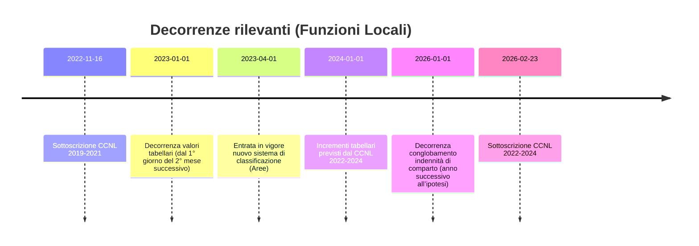

# Retribuzioni e istituti economici nel comparto Funzioni Locali tra CCNL 16.11.2022 e CCNL 23.02.2026

## Sintesi esecutiva

Il CCNL 16.11.2022 (triennio 2019–2021), pubblicato in entity["organization","Gazzetta Ufficiale","italian official journal"], aggiorna gli stipendi tabellari delle “vecchie” posizioni economiche (A1–D7) e congloba nello stipendio tabellare l’elemento perequativo (EP) per alcune fasce tramite Tabella F. citeturn9view0turn9view1

Dal 1° giorno del 5° mese successivo alla sottoscrizione definitiva del CCNL 16.11.2022 (quindi, in via applicativa, dal 1° aprile 2023), entra in vigore il nuovo sistema di classificazione a 4 Aree (Operatori, Operatori esperti, Istruttori, Funzionari ed EQ): lo “stipendio tabellare” è unico per Area (Tabella G) e le pregresse posizioni economiche cessano; il valore economico delle PEO in godimento è mantenuto come “differenziale stipendiale” (ex PEO) e può sommarsi ai nuovi “differenziali stipendiali” ottenuti con le procedure di progressione economica nell’Area. citeturn28view2turn29view0turn30view0

Il CCNL 23.02.2026 (triennio 2022–2024) alza lo stipendio tabellare **dal 1.1.2024** (Tabella A, colonna “Incremento dal 1.1.2024”; Tabella B, colonna “Dal 1.1.2024”) e realizza un **parziale conglobamento dell’indennità di comparto** nello stipendio tabellare con decorrenza dal 1.1 dell’anno successivo alla sottoscrizione dell’ipotesi di CCNL (art. 60), con conseguente rideterminazione dell’indennità residua (Tabella C) e ulteriore incremento dei tabellari (Tabella A colonna 2; Tabella B colonna 2). citeturn18view2turn7view3turn3view0turn14view0  
Una ricostruzione esterna coerente con la decorrenza **retroattiva al 1.01.2026** del conglobamento è riportata da entity["organization","Dottrina per il Lavoro","italian labor law portal"]. citeturn15view0

Risultati chiave (importi **lordi**, in euro, mensili su 12 mensilità; 13ª esclusa ma dovuta secondo le tabelle contrattuali):
- **A1**: 1.626,18 € (post-conglobamento indennità di comparto)  
- **C3**: 2.017,97 €  
- **D3**: 2.371,29 €  
(valori ricostruiti a partire dalle tabelle ufficiali CCNL 2019–2021 e dalle tabelle economiche CCNL 2022–2024). citeturn9view0turn9view1turn7view3turn30view0

## Fonti, perimetro e metodologia di calcolo

Le fonti primarie utilizzate sono:
- CCNL 16.11.2022 (triennio 2019–2021) in GU, con articoli e tabelle ufficiali (es. art. 74, art. 32; Tabelle A, E, F, G, B). citeturn23view0turn24view0turn9view0turn9view1turn30view0turn32view0turn27view0  
- CCNL 23.02.2026 (triennio 2022–2024), in versione integrale resa disponibile su sito istituzionale di entity["organization","Regione Lazio","regional gov, italy"], inclusi gli artt. 14, 25, 26, 55, 56, 60 e le Tabelle A–C. citeturn3view0turn5view2turn6view2turn16view4turn18view2turn7view3

**Assunzioni dichiarate (per evitare ambiguità):**
- Gli importi tabellari nelle tabelle contrattuali sono “valori in euro per 12 mensilità” con aggiunta della 13ª: per ottenere la **mensilità ordinaria** si divide l’annuo per 12, arrotondando ai centesimi. citeturn9view0turn9view1turn7view3turn30view0  
- Tutti gli importi sono **lordi** e non includono trattenute fiscali/previdenziali, né eventuali voci accessorie individuali (RIA, indennità di posizione/risultato EQ, incentivi, condizioni di lavoro, ecc.). La “retribuzione base/individuale/globale” usata per straordinari/turni/supplementare è esposta con formule e con esempi “a parametri minimi” (assumendo assenza di ulteriori voci individuali), perché l’art. 74 include componenti che possono variare per singolo dipendente. citeturn23view0turn16view4turn6view2turn24view0  
- Per D7, C6, B8 e A6 il valore “tabellare + EP conglobato” non è riportato nella Tabella F (EP conglobato); per tali livelli si assume **EP = 0** e si utilizza il tabellare della Tabella E (colonna 1.1.2021) come proxy del tabellare a regime del CCNL 16.11.2022. citeturn9view0turn9view1



## Retribuzioni tabellari mensili A1–D7 dopo il conglobamento dell’indennità di comparto

### Come leggere A1–D7 dopo il nuovo sistema a Aree

Dal 1° aprile 2023, gli stipendi tabellari sono unici per Area (Tabella G) e le posizioni economiche del vecchio sistema cessano; il valore economico delle PEO in godimento diventa un “differenziale stipendiale” e può sommarsi ai futuri differenziali stipendiali (progressioni economiche in Area). citeturn28view2turn29view0turn30view0

Per rispondere alla richiesta “A1–D7”, la tabella seguente ricostruisce gli importi mensili “a parità di livello economico storico” applicando:
- la base tabellare e l’EP conglobato (CCNL 16.11.2022, Tabelle E e F); citeturn9view0turn9view1  
- gli incrementi tabellari del CCNL 23.02.2026 (Tabella A, colonna 1 e Tabella B colonna 1) e il **conglobamento parziale dell’indennità di comparto** (art. 60, Tabelle A–C e Tabella B colonna 2). citeturn18view2turn7view3

### Tabella retribuzioni tabellari mensili (12 mensilità) dopo conglobamento indennità di comparto

**Colonne:**
- “Mensile 2022” = tabellare mensile (annuo/12) risultante dal CCNL 16.11.2022 (Tabella F; per D7/C6/B8/A6 da Tabella E).  
- “Mensile 2026 dal 1.1.2024” = applicazione dell’incremento tabellare dal 1.1.2024.  
- “Mensile 2026 post-conglobamento” = applicazione dell’ulteriore incremento da conglobamento dell’indennità di comparto (art. 60; Tabelle A–C).  

| Livello | Area (nuovo sistema) | Mensile 2022 (€/12) | Mensile 2026 dal 1.1.2024 | Mensile 2026 post-conglobamento |
|---|---|---:|---:|---:|
| A1 | Operatori | 1.503,70 | 1.617,21 | 1.626,18 |
| A2 | Operatori | 1.523,61 | 1.637,12 | 1.646,09 |
| A3 | Operatori | 1.554,44 | 1.667,95 | 1.676,92 |
| A4 | Operatori | 1.580,72 | 1.694,23 | 1.703,19 |
| A5 | Operatori | 1.612,08 | 1.725,59 | 1.734,56 |
| A6 | Operatori | 1.639,74 | 1.753,25 | 1.762,22 |
| B1 | Operatori esperti | 1.586,21 | 1.704,38 | 1.715,27 |
| B2 | Operatori esperti | 1.611,31 | 1.729,48 | 1.740,37 |
| B3 | Operatori esperti | 1.544,07 | 1.798,70 | 1.801,80 |
| B4 | Operatori esperti | 1.697,03 | 1.815,20 | 1.826,09 |
| B5 | Operatori esperti | 1.724,36 | 1.842,53 | 1.853,42 |
| B6 | Operatori esperti | 1.754,58 | 1.872,75 | 1.883,64 |
| B7 | Operatori esperti | 1.820,36 | 1.938,53 | 1.949,42 |
| B8 | Operatori esperti | 1.860,20 | 1.978,37 | 1.989,26 |
| C1 | Istruttori | 1.782,74 | 1.915,55 | 1.928,23 |
| C2 | Istruttori | 1.823,88 | 1.956,69 | 1.969,37 |
| C3 | Istruttori | 1.872,48 | 2.005,29 | 2.017,97 |
| C4 | Istruttori | 1.929,26 | 2.062,07 | 2.074,75 |
| C5 | Istruttori | 1.999,15 | 2.131,96 | 2.144,64 |
| C6 | Istruttori | 2.054,58 | 2.187,39 | 2.200,07 |
| D1 | Funzionari ed EQ | 1.934,36 | 2.078,47 | 2.092,84 |
| D2 | Funzionari ed EQ | 2.005,92 | 2.150,03 | 2.184,14 |
| D3 | Funzionari ed EQ | 2.212,81 | 2.356,92 | 2.371,29 |
| D4 | Funzionari ed EQ | 2.304,22 | 2.448,33 | 2.462,70 |
| D5 | Funzionari ed EQ | 2.403,29 | 2.547,40 | 2.561,77 |
| D6 | Funzionari ed EQ | 2.569,18 | 2.713,29 | 2.727,66 |
| D7 | Funzionari ed EQ | 2.691,68 | 2.835,79 | 2.850,16 |

Valori ricostruiti dalla combinazione delle Tabelle E/F del CCNL 16.11.2022 e delle Tabelle A/B del CCNL 23.02.2026; Area di appartenenza derivata dalla Tabella di trasposizione (vecchio → nuovo sistema). citeturn9view0turn9view1turn7view3turn27view0

**Nota importante (busta paga):** anche dopo il conglobamento, l’indennità di comparto non “sparisce”: viene ridotta a un valore mensile residuo (Tabella C, “valori mensili di uscita”), posto interamente a carico del Fondo risorse decentrate. Tale residuo non è incluso nella tabella sopra perché non è stipendio tabellare. citeturn18view2turn7view3

### Esempi numerici “passo-passo” (A1, C3, D3) con conglobamento

Di seguito gli esempi mostrano la costruzione dell’importo mensile **post-conglobamento** (colonna finale della tabella) utilizzando:
- tabellare annuo 2022 (Tabelle E/F) → mensile /12; citeturn9view0turn9view1  
- incremento mensile dal 1.1.2024 per 13 mensilità (Tabella A col. 1); citeturn7view3  
- quota conglobamento indennità di comparto per 13 mensilità (Tabella A col. 2). citeturn7view3turn18view2  

**Esempio A1 (Area Operatori)**  
1) Tabellare annuo 2022 (Tabella F): **18.044,37 €** → mensile 2022 = 18.044,37 / 12 = **1.503,70 €**. citeturn9view1  
2) Incremento mensile dal 1.1.2024 (Tabella A, Operatori): **+113,51 €** per 13 mensilità. citeturn7view3  
   - Effetto su mensile ordinario (12 mensilità): si applica lo stesso valore mensile, quindi 1.503,70 + 113,51 = **1.617,21 €**.  
3) Conglobamento indennità di comparto nello stipendio tabellare (Tabella A, Operatori): **+8,97 €** per 13 mensilità. citeturn7view3turn18view2  
   - Mensile post-conglobamento = 1.617,21 + 8,97 = **1.626,18 €**.

**Esempio C3 (Area Istruttori)**  
1) Tabellare annuo 2022 (Tabella F): **22.469,78 €** → mensile 2022 = 22.469,78 / 12 = **1.872,48 €**. citeturn9view1  
2) Incremento mensile dal 1.1.2024 (Istruttori): **+132,81 €** → 1.872,48 + 132,81 = **2.005,29 €**. citeturn7view3  
3) Conglobamento indennità di comparto (Istruttori): **+12,68 €** → 2.005,29 + 12,68 = **2.017,97 €**. citeturn7view3turn18view2  

**Esempio D3 (Area Funzionari ed EQ)**  
1) Tabellare annuo 2022 (Tabella F): **26.553,70 €** → mensile 2022 = 26.553,70 / 12 = **2.212,81 €**. citeturn9view1  
2) Incremento mensile dal 1.1.2024 (Funzionari ed EQ): **+144,11 €** → 2.212,81 + 144,11 = **2.356,92 €**. citeturn7view3  
3) Conglobamento indennità di comparto (Funzionari ed EQ): **+14,37 €** → 2.356,92 + 14,37 = **2.371,29 €**. citeturn7view3turn18view2  

## Differenziali stipendiali

### Che cosa sono e come si calcolano nel CCNL 23.02.2026

Il CCNL 23.02.2026 definisce i “differenziali stipendiali” come incrementi stabili (di pari importo) attribuibili nel corso della vita lavorativa, con misura annua lorda per 13 mensilità individuata nella Tabella A del CCNL 16.11.2022; la Tabella A indica anche il numero massimo attribuibile per dipendente nella stessa Area (conteggiando anche quanto maturato in enti diversi in caso di mobilità). citeturn4view1turn32view0

L’attribuzione avviene con procedura selettiva di Area, attivabile annualmente, nei limiti delle risorse del Fondo risorse decentrate; partecipano i dipendenti senza progressioni economiche negli ultimi 3 anni (termine modulabile a 2 o 4 anni dalla contrattazione integrativa) e senza sanzioni disciplinari superiori alla multa negli ultimi due anni. citeturn5view2turn5view7  
Non è attribuibile più di un differenziale per dipendente per ciascuna procedura; in caso di cumulo di “maggiorazioni” (es. educatori e iscritti agli albi), prevale quella più elevata. citeturn5view3turn4view1

### Tabella differenziali per Area: importi, limiti e varianti

**Importi base (Tabella A, CCNL 16.11.2022):** citeturn32view0  
- Operatori: 550 € annui (per 13 mensilità), max 5 differenziali  
- Operatori esperti: 650 €, max 5  
- Istruttori: 750 €, max 5  
- Funzionari ed EQ: 1.600 €, max 6  

**Maggiorazioni per Sezioni speciali (artt. 92, 96, 102, 106 CCNL 16.11.2022):**  
- Educativo/docente/insegnante in Area Istruttori: +350 € alla misura del differenziale. citeturn31view0  
- Polizia locale: operatori con funzioni di coordinamento (maggiore grado ex L. 65/1986), in Area Istruttori: +350 €. citeturn31view1  
- Iscritti a ordini/albi professionali: +150 € (Istruttori) o +200 € (Funzionari ed EQ). citeturn31view2  
- Profili sanitari/socio-sanitari/socio-assistenziali con iscrizione/abilitazione/albo: rinvio alla disciplina degli iscritti ad albi (art. 102). citeturn31view3turn31view2  

**Tabella di sintesi (importi annui, e “quota mensile” su 13 mensilità):**

| Area / Variante | Importo annuo lordo per 13 mensilità | Quota mensile (annuo/13) | Limite massimo differenziali (per dipendente) | Regola di eleggibilità essenziale | Fonte |
|---|---:|---:|---:|---|---|
| Operatori | 550 € | 42,31 € | 5 | Selezione di Area; requisito “no progressioni” (3 anni modulabile) + disciplina | Tabella A + art. 14 CCNL 2026 citeturn32view0turn5view2 |
| Operatori esperti | 650 € | 50,00 € | 5 | Come sopra | Tabella A + art. 14 citeturn32view0turn5view2 |
| Istruttori | 750 € | 57,69 € | 5 | Come sopra | Tabella A + art. 14 citeturn32view0turn5view2 |
| Funzionari ed EQ | 1.600 € | 123,08 € | 6 | Come sopra (con possibili graduatorie distinte tra EQ e non EQ) | Tabella A + art. 14 citeturn32view0turn5view5 |
| Educatori/docenti/insegnanti (Istruttori) | 1.100 € (750+350) | 84,62 € | 5 | Come Istruttori | art. 92 + art. 14 citeturn31view0turn5view2 |
| PL coordinamento (Istruttori) | 1.100 € (750+350) | 84,62 € | 5 | Come Istruttori, con requisito “funzioni di coordinamento” formalizzate | art. 96 + art. 14 citeturn31view1turn5view2 |
| Iscritti ordini/albi (Istruttori) | 900 € (750+150) | 69,23 € | 5 | Come Istruttori; prevale maggiorazione più alta in caso di concorso | art. 102 + art. 14 citeturn31view2turn5view3 |
| Iscritti ordini/albi (Funzionari/EQ) | 1.800 € (1600+200) | 138,46 € | 6 | Come Funzionari/EQ; prevale maggiorazione più alta | art. 102 + art. 14 citeturn31view2turn5view3 |

## Calcolo di straordinario, supplementare e indennità di turno

### Base retributiva: definizioni e divisori

La “nozione di retribuzione” del CCNL 16.11.2022 distingue:
- **retribuzione mensile**: stipendio tabellare;  
- **retribuzione base mensile**: retribuzione mensile + differenziali stipendiali (e altre voci stabili indicate);  
- **retribuzione individuale mensile**: retribuzione base + RIA + posizione/risultato (se spettanti) e altri elementi;  
- **retribuzione globale di fatto**: retribuzione individuale (12 mensilità) + rateo 13ª + retribuzione variabile e indennità (incl. indennità di comparto). citeturn23view0  

La **retribuzione oraria** è determinata dividendo la corrispondente retribuzione mensile per **156**. citeturn23view0  

### Lavoro straordinario: base, maggiorazioni e formula

Il compenso per lavoro straordinario è calcolato sulla **retribuzione di cui all’art. 74, comma 2, lett. b)** (retribuzione base mensile), divisa per 156 e incrementata del rateo di 13ª; si applicano maggiorazioni:
- +15% straordinario diurno  
- +30% straordinario festivo o notturno  
- +50% straordinario notturno-festivo citeturn24view0turn23view0  

Formula (ipotesi “parametri minimi”: nessuna RIA/posizione/altre voci):
- Retribuzione base mensile = (tabellare + DS ex PEO + DS nuovi, se presenti)  
- Base oraria ordinaria = Retribuzione base mensile / 156  
- Base oraria straordinario (con rateo 13ª) = (Retribuzione base mensile / 156) × (13/12)  
- Compenso orario = Base oraria straordinario × (1 + maggiorazione)

```mermaid
flowchart TD
    A[Retribuzione base mensile\n(art.74 c.2 lett. b)] --> B[Oraria = mensile/156]
    B --> C[Base straordinario = oraria × 13/12\n(rateo 13ª)]
    C --> D{Tipologia}
    D --> E[Diurno: +15%]
    D --> F[Notturno o festivo: +30%]
    D --> G[Notturno-festivo: +50%]
    E --> H[Compenso orario]
    F --> H
    G --> H
```

**Esempio rapido (post-conglobamento) su 2 ore straordinario diurno:**  
- A1: 12,99 €/h × 2 = **25,97 €**  
- C3: 16,12 €/h × 2 = **32,23 €**  
- D3: 18,94 €/h × 2 = **37,87 €**  

Calcolo basato su: art. 32 (maggiorazioni e base), art. 74 (definizioni e 156), e mensili tabellari post-conglobamento calcolati come sopra. citeturn24view0turn23view0turn7view3turn9view1

### Lavoro supplementare (part-time): base e maggiorazioni

Il CCNL 23.02.2026 disciplina il lavoro supplementare entro le 36 ore (ore oltre l’orario part-time ma entro l’orario ordinario), con:
- limite massimo **25%** dell’orario part-time (calcolato su base mensile; per verticale su ore annue);  
- compenso pari alla **retribuzione oraria globale di fatto** (art. 74, comma 2, lett. d CCNL 16.11.2022) con maggiorazione **+15%**;  
- maggiorazione **+25%** per ore eccedenti il limite massimo, restando entro l’orario ordinario. citeturn16view2turn16view4turn16view5turn23view0  

Formula minima (assumendo che l’unica indennità contrattuale sia l’indennità di comparto residua “di uscita”):
- Retribuzione globale di fatto mensile ≈ Retribuzione individuale mensile + (Retribuzione individuale mensile / 12) + Indennità di comparto (residua)  
- Retribuzione oraria globale di fatto = (globale di fatto mensile) / 156  
- Compenso supplementare orario = Retribuzione oraria globale di fatto × (1 + 0,15) oppure × (1 + 0,25)

**Esempio (C3, 4 ore supplementari entro il limite 25%):**  
- Retribuzione individuale mensile (ipotesi minima) = 2.017,97 €  
- Indennità di comparto residua (Istruttori) = 32,06 € (Tabella C “uscita”) citeturn7view3  
- Compenso supplementare orario (15%) ≈ **16,35 €/h**, quindi 4 h ≈ **65,41 €**. citeturn16view4turn23view0turn7view3  

### Indennità di turno e maggiorazioni (turnazioni)

Il CCNL 23.02.2026 definisce:
- turno notturno: 22–6; turno notturno-festivo: fascia 22–6 a cavallo del festivo;  
- limite ordinario di turni notturni mensili: max 10 salvo contrattazione integrativa;  
- indennità turnista come **maggiorazione oraria** (10% diurno; 30% notturno o festivo; 50% festivo-notturno; 100% festivo infrasettimanale), calcolata sulla retribuzione di cui all’art. 74, comma 2, lett. c (retribuzione individuale mensile). Inoltre l’indennità è corrisposta solo per le ore effettivamente rese in turno. citeturn6view1turn6view2turn6view3  

**Formula operativa (assunzione esplicita):** poiché la norma parla di “maggiorazione oraria” e il CCNL definisce il criterio di determinazione della retribuzione oraria (divisione per 156), si applica per analogia:
- Indennità turno per 1 ora = (Retribuzione individuale mensile / 156) × percentuale (10%, 30%, 50%, 100)

**Esempio (D3, 8 ore turno notturno: 30%)**  
- Retribuzione individuale mensile (ipotesi minima) = 2.371,29 €  
- Indennità turno notturno = (2.371,29 / 156 × 0,30) × 8 ≈ **36,48 €**. citeturn6view2turn23view0turn7view3  

### Prestazioni in giorno festivo / feriale non lavorativo e lavoro ordinario notturno/festivo

Il CCNL 23.02.2026 prevede, tra l’altro:
- se non si fruisce del riposo settimanale, compenso aggiuntivo **50%** della retribuzione oraria ex art. 74, comma 2, lett. b, per ogni ora prestata + riposo compensativo (24 ore consecutive);  
- lavoro festivo infrasettimanale: a scelta tra riposo compensativo o pagamento come straordinario festivo;  
- lavoro in feriale non lavorativo (articolazione su 5 giorni): riposo compensativo o straordinario non festivo;  
- lavoro ordinario notturno/festivo (anche senza rotazione turni): maggiorazione 20% (notturno **o** festivo) o 30% (notturno-festivo) della retribuzione oraria ex art. 74, comma 2, lett. b. citeturn6view4turn6view5  

## Quadro comparativo consolidato CCNL 2022 vs CCNL 2026

### Tabelle di confronto su tabellari, conglobamento e indennità di comparto

**Stipendio tabellare per Area (annuo per 12 mensilità):** Tabella G del CCNL 16.11.2022 vs Tabella B del CCNL 23.02.2026. citeturn30view0turn7view3  

| Area | Tabellare CCNL 2022 (Tab. G) | Tabellare CCNL 2026 dal 1.1.2024 | Tabellare CCNL 2026 da conglobamento ind. comparto |
|---|---:|---:|---:|
| Operatori | 18.283,31 € | 19.645,43 € | 19.753,07 € |
| Operatori esperti | 19.034,51 € | 20.452,55 € | 20.583,23 € |
| Istruttori | 21.392,87 € | 22.986,59 € | 23.138,75 € |
| Funzionari ed EQ | 23.212,35 € | 24.941,67 € | 25.114,11 € |

**Incrementi mensili della retribuzione tabellare (per 13 mensilità):** Tabella A CCNL 23.02.2026. citeturn7view3  

| Area | Incremento dal 1.1.2024 | Conglobamento ind. comparto | Incremento complessivo da conglobamento |
|---|---:|---:|---:|
| Operatori | 113,51 € | 8,97 € | 122,48 € |
| Operatori esperti | 118,17 € | 10,89 € | 129,06 € |
| Istruttori | 132,81 € | 12,68 € | 145,49 € |
| Funzionari ed EQ | 144,11 € | 14,37 € | 158,48 € |

**Indennità di comparto (valori mensili per 12 mensilità) prima e dopo il parziale conglobamento:** Tabella C CCNL 23.02.2026. citeturn7view3turn18view2  

| Area | Valore mensile “di partenza” | Quota conglobata (bilancio) | Quota conglobata (fondo) | Valore mensile residuo “di uscita” |
|---|---:|---:|---:|---:|
| Operatori | 32,40 € | 3,09 € | 6,63 € | 22,68 € |
| Operatori esperti | 39,31 € | 3,73 € | 8,06 € | 27,52 € |
| Istruttori | 45,80 € | 4,34 € | 9,40 € | 32,06 € |
| Funzionari ed EQ | 51,90 € | 4,95 € | 10,62 € | 36,33 € |

L’art. 60 chiarisce che (i) le quote conglobate entrano nello stipendio tabellare, (ii) l’indennità residua è posta interamente a carico del Fondo risorse decentrate, (iii) lo stipendio tabellare è ulteriormente incrementato dei valori mensili (Tabella A col. 2) e rideterminato (Tabella B col. 2). citeturn18view2turn18view3turn7view3  

### Confronto su differenziali stipendiali e regole di attribuzione

- **Importi e massimali**: invariati nelle misure-base (Tabella A CCNL 16.11.2022), ma il CCNL 23.02.2026 riscrive la disciplina procedurale (art. 14) rendendo più puntuali requisiti di accesso, pesi dei criteri (valutazione almeno 40%, esperienza non oltre 40%), e coordinamento con le maggiorazioni delle Sezioni speciali. citeturn32view0turn5view3turn5view4turn5view5  
- **Effetto su passaggi di Area**: i differenziali (quelli ex PEO e quelli nuovi) cessano col passaggio di Area, salvo quanto previsto dall’art. 13, comma 3 CCNL 23.02.2026 (assegno personale assorbibile). citeturn5view1turn5view7  
- **Trasparenza in busta paga**: la dichiarazione congiunta n. 1 del CCNL 23.02.2026 auspica l’evidenza dei differenziali stipendiali come voce fissa e continuativa. citeturn7view5